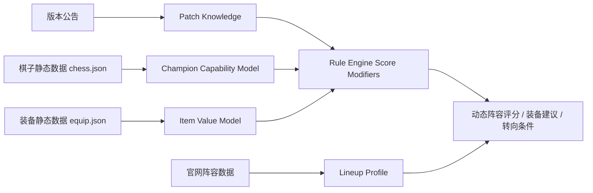

# HexSight 版本公告、棋子能力与装备收益知识库最终目标文档

## 结论

HexSight 规则引擎除了需要“官网阵容数据”这条知识链，还需要第二条知识链：**版本公告理解 + 单棋子能力模型 + 装备收益模型**。

官网阵容数据能告诉我们“推荐阵容长什么样”，但规则引擎还需要理解：

1. 为什么这个棋子适合这些装备。
2. 缺核心装备时该怎么替代。
3. 棋子伤害来自哪里，输出方式是什么。
4. 版本更新后棋子、羁绊、装备、海克斯强度如何变化。
5. 当前这局装备和棋子是否仍然支持官网推荐答案。

最终目标是：**Rust 后端能够基于版本公告、棋子机制和装备收益，动态修正阵容评分、装备建议和转阵容决策；Swift 只负责展示结果。**

---

## 一、为什么需要这条知识链

| 官网阵容数据能回答 | 仍然缺失的问题 |
|---|---|
| 主 C 是谁 | 主 C 为什么吃这些装备 |
| 推荐装备是什么 | 缺核心装时哪些装备能替代 |
| 推荐海克斯是什么 | 海克斯和棋子机制的真实关系 |
| 成型阵容是什么 | 版本改动后强度是否仍然成立 |
| 过渡阵容是什么 | 当前装备/来牌是否应该转向 |
| 运营文本是什么 | 文本是否适合当前局势和版本节奏 |

规则系统要从“照官网阵容推荐”升级为“理解阵容为什么成立”。

---

## 二、最终知识架构



| 模块 | 职责 |
|---|---|
| `Patch Knowledge` | 结构化版本公告，生成棋子/装备/羁绊/海克斯强度修正 |
| `Champion Capability Model` | 描述棋子的输出方式、技能机制、装备偏好和风险 |
| `Item Value Model` | 描述装备属性、收益类型、适配棋子类型和替代关系 |
| `Score Modifiers` | 把版本、棋子、装备知识转为阵容/动作评分修正 |
| `Rule Engine` | 合并官网阵容事实和动态知识，输出推荐与解释 |

---

## 三、版本公告知识库

### 3.1 版本公告数据目标

版本公告需要结构化为可计算数据。

| 字段 | 说明 |
|---|---|
| `patchVersion` | 版本号，例如 `17.17.3` |
| `publishedAt` | 发布时间 |
| `sourceUrl` | 官方公告链接或本地快照路径 |
| `targetType` | `champion` / `trait` / `item` / `augment` / `system` |
| `targetId` | hero_id / trait_id / equip_id / hex_id |
| `targetName` | 可读名称 |
| `changeType` | `buff` / `nerf` / `adjust` / `rework` |
| `changedStats` | 技能倍率、蓝耗、生命值、装备属性等 |
| `impactScore` | 对规则评分的数值修正 |
| `affectedLineups` | 受影响阵容 ID 列表 |
| `reason` | 改动原因或规则解释 |

### 3.2 版本改动类型

| 改动对象 | 规则影响 |
|---|---|
| 棋子加强 | 主 C / 主坦相关阵容加分 |
| 棋子削弱 | 依赖该棋子的阵容扣分 |
| 羁绊加强 | 高羁绊阵容和过渡羁绊加分 |
| 羁绊削弱 | 相关阵容降低基础强度 |
| 装备加强 | 装备优先级和适配分提高 |
| 装备削弱 | 依赖该装备的阵容降低评分 |
| 海克斯加强 | 命中推荐海克斯的阵容加分 |
| 海克斯削弱 | 海克斯适配分下降 |
| 系统节奏调整 | 影响升级、掉血、经济、赌狗阈值 |

### 3.3 版本修正分

```text
版本修正分 =
棋子版本修正
+ 羁绊版本修正
+ 装备版本修正
+ 海克斯版本修正
+ 系统节奏修正
```

示例：

| 改动 | 规则结果 |
|---|---|
| 主 C 技能伤害提升 | 相关阵容基础分上升 |
| 主 C 蓝耗降低 | 回蓝装备权重下降，输出装备权重上升 |
| 核心装备削弱 | 装备匹配分降低，替代装备权重上升 |
| 羁绊削弱 | 高羁绊路线扣分 |
| 系统节奏加快 | 速 9、贪经济、慢 D 风险提高 |

---

## 四、棋子能力模型

### 4.1 棋子能力字段

每个棋子最终应拥有一份能力画像。

| 字段 | 说明 |
|---|---|
| `heroId` | 棋子 ID |
| `name` | 棋子名称 |
| `cost` | 费用 |
| `traits` | 种族/职业羁绊 |
| `role` | 主 C / 副 C / 主坦 / 副坦 / 辅助 / 挂件 |
| `damageProfile` | `ad` / `ap` / `hybrid` / `true_damage` / `tank` / `utility` |
| `damagePattern` | `burst` / `sustained` / `execute` / `aoe` / `single_target` / `summon` |
| `castPattern` | `mana_cast` / `attack_based` / `passive` / `transform` / `summon` |
| `scalingStats` | AD、AP、攻速、暴击、回蓝、生命、双抗等 |
| `positionRole` | 前排、后排、近战 C、远程 C、辅助 |
| `itemStrictness` | 装备严格度 |
| `powerSpikes` | 二星、三星、装备件数、羁绊节点 |
| `riskProfile` | 怕控制、怕切后、怕重伤、怕爆发等 |

### 4.2 输出方式分类

| 类型 | 装备收益倾向 |
|---|---|
| AD 普攻型 | 攻击力、攻速、暴击、穿甲收益高 |
| AD 技能型 | 攻击力、暴击、回蓝、破防收益高 |
| AP 爆发型 | 法强、暴击、启动、破防收益高 |
| AP 持续型 | 法强、攻速、回蓝、续航收益高 |
| 低蓝条法师 | 回蓝收益可能递减，输出装价值上升 |
| 高蓝条法师 | 启动装、回蓝装价值更高 |
| 前排战士 | 半肉、续航、泰坦类装备收益高 |
| 主坦 | 血量、双抗、减伤、回复、团队功能收益高 |
| 辅助 | 功能装、启动装、团队光环收益高 |
| 召唤/召唤物型 | 需要单独判断召唤物是否继承属性 |

### 4.3 棋子能力示例

```json
{
  "heroId": "14382",
  "name": "示例主C",
  "cost": 4,
  "role": "primary_carry",
  "damageProfile": "ap",
  "damagePattern": "sustained_aoe",
  "castPattern": "mana_cast",
  "scalingStats": ["ability_power", "mana", "attack_speed"],
  "positionRole": "backline",
  "itemStrictness": "medium",
  "powerSpikes": [
    { "type": "star", "value": 2, "impact": 30 },
    { "type": "item_count", "value": 2, "impact": 20 },
    { "type": "trait", "value": "核心羁绊", "impact": 15 }
  ],
  "riskProfile": ["assassin", "crowd_control", "burst_damage"]
}
```

---

## 五、装备收益模型

### 5.1 装备字段

| 字段 | 说明 |
|---|---|
| `itemId` | 装备 ID |
| `name` | 装备名称 |
| `type` | 基础装备、成型装备、神器、光明、特殊装备等 |
| `stats` | 攻击力、法强、攻速、生命、双抗、暴击等 |
| `effectTags` | 回蓝、续航、破防、重伤、护盾、减伤、团队光环等 |
| `bestForProfiles` | 最适合的棋子机制类型 |
| `badForProfiles` | 低收益的棋子机制类型 |
| `replacementGroup` | 可替代装备组 |
| `conflictGroup` | 收益冲突或递减装备组 |
| `stageBias` | 前期强、中期强、后期强 |

### 5.2 装备收益维度

| 维度 | 说明 |
|---|---|
| 输出收益 | 提升技能或普攻伤害 |
| 施法收益 | 提高技能释放频率 |
| 启动收益 | 加快第一轮技能 |
| 生存收益 | 让主 C 或前排活得更久 |
| 破防收益 | 解决高抗性前排 |
| 续航收益 | 提供吸血、回血、护盾 |
| 团队收益 | 减抗、重伤、光环、控制 |
| 替代价值 | 缺核心装备时是否可接受 |
| 装备冲突 | 属性重复或收益递减 |

### 5.3 棋子装备评分

```text
棋子装备分 =
机制匹配
+ 核心属性收益
+ 技能频率收益
+ 生存收益
+ 当前阵容需求
+ 当前对手环境
+ 版本装备修正
- 收益递减
- 装备冲突
```

---

## 六、核心装、替代装、应急装

装备建议不能只有“推荐/不推荐”，需要分级。

| 装备等级 | 含义 | 规则用途 |
|---|---|---|
| `core` | 最优或关键装备 | 阵容装备匹配大加分 |
| `strong` | 高收益装备 | 可作为主要推荐 |
| `acceptable` | 可接受替代 | 缺核心装时保强度 |
| `emergency` | 应急装备 | 血量低或装备错时止损 |
| `bad` | 低收益装备 | 提醒转阵容或换承载者 |

示例：

```json
{
  "heroId": "14382",
  "itemPreferences": {
    "core": ["法爆", "青龙刀"],
    "strong": ["帽子", "纳什之牙", "科技枪"],
    "acceptable": ["巨杀", "破防者"],
    "emergency": ["任意法强装"],
    "bad": ["纯攻击力装备"]
  }
}
```

---

## 七、缺核心装备时的决策

| 缺口 | 规则建议 |
|---|---|
| 缺启动装 | 找回蓝、攻速、启动替代，或换低蓝耗主 C |
| 缺暴击装 | 用法强、攻击力、破防类补输出 |
| 缺穿透/破防 | 对手前排强时优先补破防 |
| 缺吸血/续航 | 主 C 容易暴毙时补续航或站位保护 |
| 缺主坦装 | 输出装再好也可能打不完，优先补前排 |
| 输出装溢出 | 推荐副 C 或转输出更多的阵容 |
| 坦装溢出 | 推荐前排体系或后期高费输出补伤害 |
| 装备完全错 | 推荐转阵容或换装备承载英雄 |

---

## 八、简化伤害 / 收益评估阶段

第一版不需要完整战斗模拟，先做机制收益评分。

| 阶段 | 能力 |
|---|---|
| 第一版 | 机制标签 + 装备适配评分 |
| 第二版 | 技能倍率、蓝条、攻速、施法频率估算 |
| 第三版 | 简化 DPS / EHP 计算 |
| 第四版 | 对手阵容环境修正 |
| 第五版 | 战斗模拟或录像数据校准 |

### 8.1 简化 DPS 估算方向

| 棋子类型 | 估算重点 |
|---|---|
| 普攻型 | 攻击力 × 攻速 × 暴击 × 穿透 |
| 技能爆发型 | 技能倍率 × 法强/攻击力 × 暴击/破防 × 施法次数 |
| 持续施法型 | 单次技能收益 × 时间内施法频率 |
| 前排战士 | 输出 + 生存时间 |
| 主坦 | 有效生命 EHP + 控制/功能收益 |
| 辅助 | 团队增益覆盖率 + 启动速度 |

---

## 九、版本公告与阵容评分结合

最终阵容评分应加入版本修正和棋子装备收益。

```text
阵容评分 =
官网阵容基础分
+ 当前装备/棋子/海克斯匹配
+ 棋子能力模型评分
+ 装备收益评分
+ 版本公告修正
+ 当前局势修正
- 风险扣分
```

| 情况 | 规则影响 |
|---|---|
| 主 C 版本加强 | 阵容基础分上升 |
| 主 C 版本削弱 | 阵容基础分下降 |
| 主 C 蓝耗降低 | 回蓝装备需求下降，输出装价值上升 |
| 主 C 技能倍率提高 | 法强/攻击力装备价值上升 |
| 核心装备削弱 | 装备匹配分下降，替代装备上升 |
| 羁绊加强 | 高羁绊阵容评分上升 |
| 系统节奏加快 | 贪经济、速 9、慢 D 风险提高 |
| 赌狗核心削弱 | 赌狗资格阈值提高 |

---

## 十、和现有规则引擎的关系

| 现有规则链 | 新知识链如何补强 |
|---|---|
| 阵容候选评分 | 加入棋子版本强度和机制适配 |
| 装备匹配评分 | 从“命中推荐装备”升级为“理解装备收益” |
| 海克斯评分 | 根据棋子机制判断海克斯收益 |
| 赌狗资格评分 | 根据棋子三星收益和版本强度调整阈值 |
| 过渡阶段规则 | 根据打工棋子能力和装备承载能力判断过渡强度 |
| 转阵容条件 | 缺核心装或核心棋子被削弱时更早转向 |
| LLM 上下文 | 输出棋子机制、装备替代和版本影响解释 |

---

## 十一、Rust 模块目标

| 模块 | 建议路径 | 职责 |
|---|---|---|
| 版本公告模型 | `crates/hexsight-core/src/patch.rs` | 定义版本改动结构 |
| 棋子能力模型 | `crates/hexsight-core/src/champion_capability.rs` | 定义棋子机制标签和能力画像 |
| 装备收益模型 | `crates/hexsight-core/src/item_value.rs` | 定义装备收益、替代、冲突关系 |
| 版本知识加载 | `crates/hexsight-engine/src/patch_knowledge.rs` | 加载公告结构化数据 |
| 装备评分器 | `crates/hexsight-engine/src/item_scorer.rs` | 计算棋子 + 装备收益、替代装和冲突收益 |
| 棋子评分器 | `crates/hexsight-engine/src/champion_scorer.rs` | 计算棋子当前局势价值 |
| 海克斯刷新评分器 | `crates/hexsight-engine/src/augment_reroll_scorer.rs` | 判断当前三个海克斯是拿、刷新还是兜底 |
| 打工承载者评分器 | `crates/hexsight-engine/src/holder_scorer.rs` | 根据棋盘、备战席、装备席推荐临时装备承载者 |
| 版本修正器 | `crates/hexsight-engine/src/patch_modifier.rs` | 生成阵容/装备/海克斯修正分 |

---

## 十二、自动推理优先与人工校准边界

这个阶段的核心原则是：**静态说明书数据先自动结构化，当前对局信息实时推理，人工只补强度、例外和版本特殊机制**。

### 12.1 知识来源分层

| 类型 | 内容 | 来源 | 工程处理 |
|---|---|
| 数据可抽取 | 英雄技能、装备属性、羁绊描述、海克斯描述 | `chess.json`、`equip.json`、`trait.json`、`hex.json` | Rust 解析成机制标签和数值标签 |
| 阵容强先验 | 主 C、主坦、推荐装备、推荐海克斯、运营节奏 | 官网阵容数据 | 作为 core 装备、强适配海克斯、阵容评分基础 |
| 实时状态 | 当前棋盘、备战席、装备席、血量、金币、等级、已拿海克斯 | 画面识别结果 | 实时计算装备承载者、海克斯拿/刷、过渡强度 |
| 规则词典 | 冲突组、替代组、收益递减、机制适配 | 配置文件 + 通用游戏规则 | 配置化维护，避免写死代码 |
| 人工校准 | 版本强度分、赌狗阈值、特殊英雄机制、特殊海克斯 | 实战经验、版本公告、后续统计 | 通过覆写文件和校准数据修正 |

### 12.2 主 C 装备刚需与弹性

阵容推荐数据已经给出主 C 装备，这是装备判断的强先验。规则引擎需要进一步区分：有些主 C 必须拿到核心装备才能承担主 C，有些主 C 可以用多套装备替代。

```text
主C装备适配 =
官网推荐装备命中
+ 棋子机制匹配
+ 当前散件可合成度
+ 替代装备收益
+ 当前阶段止血价值
- 缺核心装惩罚
- 装备冲突惩罚
```

| 类型 | 判断 | 规则影响 |
|---|---|---|
| 装备刚需型 | 缺启动装、核心输出装或关键生存装会明显掉强度 | 缺核心装时阵容大幅降分，提示找替代或转阵容 |
| 装备弹性型 | 多套输出装或半肉装都能工作 | 缺单件核心装时小幅降分，优先推荐替代装 |
| 机制绑定型 | 技能机制和某类装备强绑定，例如高蓝条依赖启动、普攻型依赖攻速 | 装备缺口直接影响是否锁阵容 |
| 前排战士型 | 输出和生存同时决定能否主 C | 装备评分同时看伤害、续航、抗性和站位风险 |
| 功能主 C | 强度来自控制、减抗、治疗、护盾或团队收益 | 装备评分看覆盖率和启动速度 |

### 12.3 装备冲突与边际收益

装备冲突不能简单禁止，应按队伍覆盖率和边际收益降权。已有同类效果时，重复来源收益下降；覆盖不足或对手环境需要时，重复来源仍可保留价值。

| 冲突组 | 典型来源 | 规则 |
|---|---|---|
| `anti_heal` 减治疗 / 重伤 | 日炎、红霸符、鬼书类、日炎棋盘、部分海克斯 | 已有稳定覆盖时，第二个重伤来源降权 |
| `burn` 灼烧 | 红霸符、日炎、神明奖励、部分海克斯 | 已有全场灼烧时，单点灼烧收益下降 |
| `armor_shred` 护甲击碎 | 薄暮类、英雄技能、羁绊、海克斯 | 同目标不叠加，按覆盖率和 AD 阵容需求计分 |
| `mr_shred` 魔抗击碎 | 离子火花、英雄技能、羁绊、海克斯 | AP 阵容收益高，重复来源按覆盖范围降权 |
| `mana_engine` 回蓝 / 启动 | 蓝霸符、青龙刀、启动类海克斯 | 低蓝条棋子收益递减，高蓝条棋子收益提高 |
| `crit_enable` 技能暴击 / 暴击体系 | 法爆、无尽、技能暴击海克斯 | 需要和伤害类型、技能是否可暴击联动 |
| `sustain` 续航 | 饮血、科技枪、全能吸血海克斯 | 自带高续航时降权，对手爆发高时保留价值 |
| `shield_survival` 护盾保命 | 夜刃、护盾装、护盾羁绊 | 防爆发价值高，重复保命触发降权 |
| `aura_team_buff` 光环 / 团队装 | 圣杯、旗子、团队增益海克斯 | 看站位覆盖人数和主 C 是否吃到 |
| `unique_trigger` 单次触发 | 每场战斗仅触发 1 次类装备 | 同一棋子重复装备价值下降 |

示例判断：

| 场景 | 输出 |
|---|---|
| 已有日炎棋盘，再出现红霸符 | 重伤收益下降，攻速和输出收益保留 |
| 已有红霸符在单体主 C，前排可合日炎 | 若重伤覆盖不足，日炎仍可作为范围覆盖补充 |
| AP 阵容已有离子火花 | 第二个魔抗击碎来源降权，除非能覆盖不同目标 |
| 对手回复阵容多 | 重伤冲突惩罚降低，覆盖稳定性加分 |

### 12.4 海克斯拿取、刷新与兜底

每轮海克斯默认出现 3 个候选项，并且有 1 次刷新机会。规则引擎要把海克斯选择输出成即时动作：拿、刷新、刷后兜底。

| 动作 | 触发条件 | 输出 |
|---|---|---|
| `take` | 当前最高分海克斯达到阈值 | 直接拿，并说明锁方向程度 |
| `reroll` | 三个候选项都低于最低可接受分，且刷新期望更高 | 建议刷新 |
| `take_fallback` | 刷后仍无理想项，或刷新价值不足 | 选择覆盖最多候选阵容、风险最低的海克斯 |

```text
海克斯评分 =
当前收益
+ 支持候选阵容数量
+ 玩法开关价值
+ 装备/经济/战力补短板价值
+ 当前阶段价值
+ 后续转向弹性
- 锁方向风险
- 当前局势不匹配
- 与已有海克斯/装备/羁绊冲突
```

```text
刷新判断 =
当前最佳海克斯分 < 当前阶段最低可接受分
且 预估刷新收益 > 当前最佳分 + 刷新机会价值
```

| 局面 | 兜底优先级 |
|---|---|
| 阵容未定 | 装备类 / 经济类 / 通用战力 |
| 血量低 | 即时战力 / 前排 / 成装 |
| 装备很差 | 装备补强 / 重铸 / 散件 |
| 经济很好 | 经验 / 经济 / 高上限 |
| 核心牌多 | 赌狗开关 / 刷新类 |
| 已锁阵容 | 推荐海克斯 / 羁绊强化 / 核心英雄强化 |
| 三个都很差 | 覆盖最多候选阵容、锁定风险最低的 |

### 12.5 打工棋子与装备承载者实时计算

打工棋子能力需要结合当前棋盘、备战席、装备席和羁绊判断。工具应直接告诉玩家装备现在给谁、后续转给谁、为什么。

```text
打工棋子分 =
基础战力
+ 二星/对子价值
+ 当前装备承载能力
+ 当前羁绊贡献
+ 后续阵容保留价值
+ 前排/输出/控制补位价值
- 卖掉成本
- 占格子成本
- 和目标阵容冲突
```

| 实时输入 | 作用 |
|---|---|
| 当前上场棋子 | 判断前排、输出、控制和已激活羁绊 |
| 备战席棋子 | 判断对子、可替换打工牌和潜在转阵容 |
| 装备席散件 | 判断能合什么即时战力装 |
| 已成装 | 判断最佳临时承载者和最终承载者 |
| 当前等级/金币/血量 | 判断稳血、贪经济、D 牌 |
| 当前海克斯 | 判断玩法开关和战力修正 |
| 对手环境 | 判断重伤、破甲、魔抗击碎、后排保护价值 |

### 12.6 人工校准保留项

人工补充的职责应收敛到少量高价值校准项。

| 人工校准项 | 说明 |
|---|---|
| 版本改动影响分 | buff/nerf 对阵容、装备、海克斯到底加减多少分 |
| 特殊英雄机制 | 文本难解析、隐藏机制、召唤物继承规则 |
| 特殊海克斯机制 | 文本难解析、改变玩法节奏或改变输出方式 |
| 赌狗核心强度 | 三星后是否足够锁血，当前版本是否值得赌 |
| 打工棋子强度覆写 | 某些低费卡实际过渡强度明显高于文本解析 |
| 对手环境权重 | 前排多、回复多、控制多时各类装备的修正权重 |

---

## 十三、落地阶段

### 阶段 1：标签化

| 交付 | 验收 |
|---|---|
| 棋子能力标签 | 每个主流主 C / 主坦有输出类型和装备偏好 |
| 装备收益标签 | 每件常用成装有收益类型和适配 profile |
| 装备冲突组标签 | 重伤、灼烧、破甲、魔抗击碎、回蓝、续航等冲突组可识别 |
| 海克斯类型标签 | 经济、战力、装备、羁绊、英雄专属、赌狗开关、模式特殊可识别 |
| 版本改动结构 | 能手动录入版本公告改动 |

### 阶段 2：装备替代规则

| 交付 | 验收 |
|---|---|
| core/strong/acceptable/emergency 分级 | 基于官网推荐装和棋子机制区分刚需装、强替代、应急装 |
| 装备冲突检测 | 能识别重复重伤、重复减抗、重复回蓝等边际收益下降 |
| 装备承载者推荐 | 能结合棋盘、备战席、装备席建议打工棋子和最终主 C |
| 缺装转向判断 | 核心装缺失且替代收益低时，能推荐装备更适配阵容 |

### 阶段 3：海克斯拿取与刷新决策

| 交付 | 验收 |
|---|---|
| `take / reroll / take_fallback` 动作 | 每轮 3 个海克斯能输出拿、刷新或兜底拿 |
| 刷新阈值 | 当前最佳海克斯低于阈值时能判断是否值得刷新 |
| 刷后兜底策略 | 刷后仍无理想项时能选覆盖最高、锁定风险最低的选项 |
| 海克斯短解释 | 玩家能在临场快速理解为什么拿或为什么刷 |

### 阶段 4：版本修正评分

| 交付 | 验收 |
|---|---|
| patch modifier | 版本 buff/nerf 能影响阵容评分 |
| affected lineups | 能找出受影响阵容 |
| 规则解释 | 能输出“该阵容因某棋子削弱而降分” |

### 阶段 5：简化收益估算

| 交付 | 验收 |
|---|---|
| 简化 DPS/EHP | 能比较同一棋子不同装备组合收益 |
| 阵容环境修正 | 能根据对手前排/后排/控制修正装备建议 |
| 即时动作输出 | 能在当前局面下输出合装、给谁、拿海克斯、是否转向 |

---

## 十四、P0-P7 实施路径

这一阶段按 P 级逐步实现，每个 P 级都必须独立可验收。核心目标是先把每个版本的说明书数据吃成结构化知识，再逐步接入装备、海克斯、版本、实时局面决策。

### P0：版本知识底座

| 项 | 内容 |
|---|---|
| 目标 | 建立棋子、装备、海克斯、羁绊的统一知识模型和解析覆盖率报告 |
| 核心模块 | `champion_capability.rs`、`item_value.rs`、`augment_effect_profile.rs`、`trait_effect_profile.rs` |
| 配置产物 | `config/rules/<version>/knowledge_keywords.json`、`manual_overrides.json` |
| 输入 | `chess.json`、`equip.json`、`hex.json`、`trait.json`、`race.json`、`job.json` |
| 输出 | `ChampionCapability`、`ItemValueProfile`、`AugmentEffectProfile`、`TraitEffectProfile` |
| 验收 | 每个 mode 能生成知识模型；输出未知标签、低置信度条目和需覆写项 |

P0 不追求推荐完美，重点是让系统知道每个版本的数据里有什么、哪些解析成功、哪些需要人工覆写。

### P1：主 C 装备刚需与替代装

| 项 | 内容 |
|---|---|
| 目标 | 根据官网推荐装和棋子机制，判断主 C 装备刚需、强替代、应急装 |
| 核心模块 | `item_scorer.rs`、`champion_item_fit.rs` |
| 配置产物 | `item_replacement_groups.json`、`champion_item_overrides.json` |
| 输入 | 阵容推荐装备、棋子能力模型、装备收益模型、当前散件/成装 |
| 输出 | `core / strong / acceptable / emergency / bad` 分级和缺装惩罚 |
| 验收 | 缺核心装时能给出替代装；装备错配时能降低阵容评分并解释原因 |

P1 要把“官网推荐装”作为强先验，同时允许规则根据棋子机制找到合理替代。

### P2：装备冲突与边际收益

| 项 | 内容 |
|---|---|
| 目标 | 识别重复重伤、灼烧、减抗、回蓝、续航等冲突，并按边际收益降权 |
| 核心模块 | `item_conflict_scorer.rs`、`team_effect_coverage.rs` |
| 配置产物 | `item_conflict_groups.json`、`stacking_policy.json` |
| 输入 | 已有装备、已拿海克斯、羁绊效果、英雄技能效果、对手环境 |
| 输出 | 冲突警告、降权分、覆盖率解释 |
| 验收 | 已有日炎/红霸符/日炎棋盘时，重复重伤能降权；AP 阵容已有离子时，重复魔抗击碎能降权 |

P2 的判断原则是覆盖率和边际收益。重复效果不直接判死刑，按当前局面计算剩余价值。

### P3：打工棋子与装备承载者

| 项 | 内容 |
|---|---|
| 目标 | 根据当前棋盘、备战席、装备席，推荐装备现在给谁、后续转给谁 |
| 核心模块 | `holder_scorer.rs`、`bench_transition_scorer.rs` |
| 配置产物 | `holder_rules.json`、`workhorse_overrides.json` |
| 输入 | 上场棋子、备战席棋子、装备席、当前羁绊、目标阵容候选 |
| 输出 | 最佳临时承载者、备用承载者、最终转移对象、卖出成本 |
| 验收 | 能推荐打工 C / 打工坦克；能判断装备给当前二星还是等目标主 C |

P3 直接服务临场操作，输出要短：合什么、给谁、后续给谁。

### P4：海克斯拿取、刷新与兜底

| 项 | 内容 |
|---|---|
| 目标 | 对每轮 3 个海克斯输出 `take / reroll / take_fallback` |
| 核心模块 | `augment_reroll_scorer.rs`、`augment_option_ranker.rs` |
| 配置产物 | `augment_thresholds.json`、`augment_type_weights.json` |
| 输入 | 当前三个海克斯、刷新机会、候选阵容、装备/棋盘/血量/经济 |
| 输出 | 是否刷新、推荐海克斯、兜底海克斯、锁方向风险 |
| 验收 | 三个候选都低分时能建议刷新；刷后低分时能选覆盖最高、锁定风险最低的 |

P4 要把“海克斯说明书”转成即时选择。第一海克斯偏弹性，后续海克斯偏阵容成型和补短板。

### P5：版本公告与强度修正

| 项 | 内容 |
|---|---|
| 目标 | 把版本公告 buff/nerf 转成棋子、装备、羁绊、海克斯评分修正 |
| 核心模块 | `patch_knowledge.rs`、`patch_modifier.rs` |
| 配置产物 | `patch_knowledge.json`、`patch_knowledge_overrides.json` |
| 输入 | 官方公告、本地结构化版本改动、阵容档案 |
| 输出 | 受影响目标、影响分、受影响阵容、解释文本 |
| 验收 | 手动录入主 C 削弱后，相关阵容评分下降；装备加强后，阵容装备适配分和总分上升 |

P5 解决版本更新问题。版本变化优先改数据和覆写，规则代码保持稳定。

### P6：简化收益估算与环境修正

| 项 | 内容 |
|---|---|
| 目标 | 基于棋子机制、装备、羁绊、对手环境估算 DPS/EHP 和收益差 |
| 核心模块 | `combat_value_estimator.rs`、`environment_modifier.rs` |
| 配置产物 | `combat_value_weights.json`、`environment_weights.json` |
| 输入 | 棋子能力模型、装备收益模型、当前棋盘、对手前排/回复/控制/后排威胁 |
| 输出 | 简化 DPS、EHP、装备收益差、环境修正分 |
| 验收 | 能比较同一主 C 不同装备组合；对手回复多时重伤价值提高；前排厚时破防价值提高 |

P6 不做完整战斗模拟，先做能服务决策的收益估算。

### P7：规则输出集成与回归样例

| 项 | 内容 |
|---|---|
| 目标 | 把 P0-P6 结果接入最终 `RuleOutput`，形成可回放回归样例 |
| 核心模块 | `knowledge_decision_planner.rs`、`knowledge_regression.rs` |
| 配置产物 | `config/rules/<version>/regression_cases/*.json` |
| 输入 | P0-P6 输出、当前对局状态、阵容候选 |
| 输出 | 装备动作、海克斯动作、承载者、转阵容条件、短解释 |
| 验收 | `cargo test --workspace` 覆盖知识解析、装备冲突、海克斯刷新、版本修正、即时动作输出 |

P7 是阶段收口点。之后每次规则争议都必须沉淀为回归样例，版本更新后先跑回归。

### P 级依赖顺序

```text
P0 知识底座
 -> P1 主C装备适配
 -> P2 装备冲突
 -> P3 打工承载者
 -> P4 海克斯刷新
 -> P5 版本修正
 -> P6 简化收益估算
 -> P7 RuleOutput 集成与回归
```

| P 级 | 可以并行的内容 | 依赖 |
|---|---|---|
| P0 | 棋子/装备/海克斯/羁绊解析可并行 | 无 |
| P1 | 装备分级、替代组、刚需判断可并行 | P0 |
| P2 | 冲突组和覆盖率可并行 | P0/P1 |
| P3 | 承载者评分可和 P4 并行 | P0/P1 |
| P4 | 海克斯评分可和 P3 并行 | P0 |
| P5 | 版本公告结构可提前建模 | P0 |
| P6 | 收益估算依赖装备/棋子/冲突 | P1/P2/P3 |
| P7 | 集成和回归 | P0-P6 |

---

## 十五、验收标准

| 验收项 | 证明方式 |
|---|---|
| 棋子机制可读 | 主流主 C 能输出伤害类型、输出模式、装备偏好 |
| 装备替代可用 | 缺核心装备时能给出至少 2 个替代方案 |
| 版本改动可计算 | 手动录入 buff/nerf 后阵容评分发生合理变化 |
| 装备收益可解释 | 能说明某装备为什么适合或不适合某棋子 |
| 装备冲突可解释 | 已有重伤、灼烧、减抗等来源时能说明重复收益下降 |
| 海克斯刷新可用 | 三个候选海克斯能输出拿、刷或兜底拿 |
| 装备承载者可用 | 当前棋盘/备战席/装备席能给出临时承载者和最终承载者 |
| 转阵容建议可触发 | 装备严重错配时能推荐更适配阵容 |
| Rust 测试覆盖 | `cargo test --workspace` 覆盖棋子、装备、海克斯刷新、版本修正 |
| Swift 只展示 | Swift 不参与装备收益和版本修正计算 |

---

## 十六、最终目标

最终规则引擎要做到：

1. 能追踪版本公告，知道哪些棋子、装备、羁绊、海克斯被加强或削弱。
2. 能理解每个主流棋子的输出方式、技能机制和装备收益。
3. 能在缺核心装备时推荐替代装备或转阵容。
4. 能把版本改动转成阵容、装备、海克斯评分修正。
5. 能解释“为什么这个棋子适合这件装备”。
6. 能解释“为什么当前装备不适合继续硬玩这套阵容”。
7. 能在海克斯三选一时判断拿、刷新或兜底拿。
8. 能结合当前棋盘、备战席和装备席推荐临时打工承载者。
9. 能把这些知识合并进 Rust 规则引擎，Swift 只展示结论。
