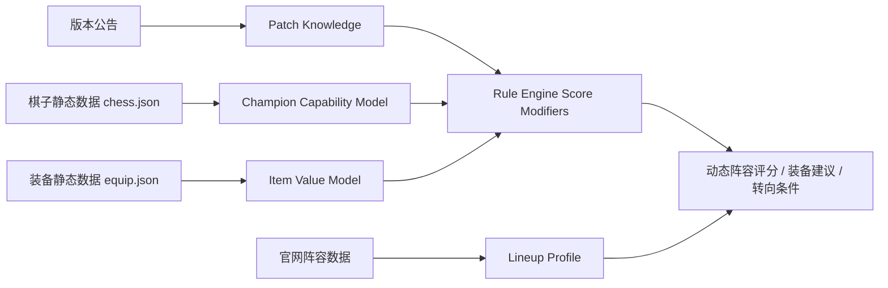

# HexSight 版本公告、棋子能力与装备收益知识库最终目标文档

## 结论

HexSight 规则引擎除了需要“官网阵容数据”这条知识链，还需要第二条知识链：**版本公告理解 + 单棋子能力模型 + 装备收益模型**。

官网阵容数据能告诉我们“推荐阵容长什么样”，但规则引擎还需要理解：

1. 为什么这个棋子适合这些装备。
2. 缺核心装备时该怎么替代。
3. 棋子伤害来自哪里，输出方式是什么。
4. 版本更新后棋子、羁绊、装备、海克斯强度如何变化。
5. 当前这局装备和棋子是否仍然支持官网推荐答案。

最终目标是：**Rust 后端能够基于版本公告、棋子机制和装备收益，动态修正阵容评分、装备建议和转阵容决策；Swift 只负责展示结果。**

---

## 一、为什么需要这条知识链

| 官网阵容数据能回答 | 仍然缺失的问题 |
|---|---|
| 主 C 是谁 | 主 C 为什么吃这些装备 |
| 推荐装备是什么 | 缺核心装时哪些装备能替代 |
| 推荐海克斯是什么 | 海克斯和棋子机制的真实关系 |
| 成型阵容是什么 | 版本改动后强度是否仍然成立 |
| 过渡阵容是什么 | 当前装备/来牌是否应该转向 |
| 运营文本是什么 | 文本是否适合当前局势和版本节奏 |

规则系统要从“照官网阵容推荐”升级为“理解阵容为什么成立”。

---

## 二、最终知识架构



| 模块 | 职责 |
|---|---|
| `Patch Knowledge` | 结构化版本公告，生成棋子/装备/羁绊/海克斯强度修正 |
| `Champion Capability Model` | 描述棋子的输出方式、技能机制、装备偏好和风险 |
| `Item Value Model` | 描述装备属性、收益类型、适配棋子类型和替代关系 |
| `Score Modifiers` | 把版本、棋子、装备知识转为阵容/动作评分修正 |
| `Rule Engine` | 合并官网阵容事实和动态知识，输出推荐与解释 |

---

## 三、版本公告知识库

### 3.1 版本公告数据目标

版本公告需要结构化为可计算数据。

| 字段 | 说明 |
|---|---|
| `patchVersion` | 版本号，例如 `17.17.3` |
| `publishedAt` | 发布时间 |
| `sourceUrl` | 官方公告链接或本地快照路径 |
| `targetType` | `champion` / `trait` / `item` / `augment` / `system` |
| `targetId` | hero_id / trait_id / equip_id / hex_id |
| `targetName` | 可读名称 |
| `changeType` | `buff` / `nerf` / `adjust` / `rework` |
| `changedStats` | 技能倍率、蓝耗、生命值、装备属性等 |
| `impactScore` | 对规则评分的数值修正 |
| `affectedLineups` | 受影响阵容 ID 列表 |
| `reason` | 改动原因或规则解释 |

### 3.2 版本改动类型

| 改动对象 | 规则影响 |
|---|---|
| 棋子加强 | 主 C / 主坦相关阵容加分 |
| 棋子削弱 | 依赖该棋子的阵容扣分 |
| 羁绊加强 | 高羁绊阵容和过渡羁绊加分 |
| 羁绊削弱 | 相关阵容降低基础强度 |
| 装备加强 | 装备优先级和适配分提高 |
| 装备削弱 | 依赖该装备的阵容降低评分 |
| 海克斯加强 | 命中推荐海克斯的阵容加分 |
| 海克斯削弱 | 海克斯适配分下降 |
| 系统节奏调整 | 影响升级、掉血、经济、赌狗阈值 |

### 3.3 版本修正分

```text
版本修正分 =
棋子版本修正
+ 羁绊版本修正
+ 装备版本修正
+ 海克斯版本修正
+ 系统节奏修正
```

示例：

| 改动 | 规则结果 |
|---|---|
| 主 C 技能伤害提升 | 相关阵容基础分上升 |
| 主 C 蓝耗降低 | 回蓝装备权重下降，输出装备权重上升 |
| 核心装备削弱 | 装备匹配分降低，替代装备权重上升 |
| 羁绊削弱 | 高羁绊路线扣分 |
| 系统节奏加快 | 速 9、贪经济、慢 D 风险提高 |

---

## 四、棋子能力模型

### 4.1 棋子能力字段

每个棋子最终应拥有一份能力画像。

| 字段 | 说明 |
|---|---|
| `heroId` | 棋子 ID |
| `name` | 棋子名称 |
| `cost` | 费用 |
| `traits` | 种族/职业羁绊 |
| `role` | 主 C / 副 C / 主坦 / 副坦 / 辅助 / 挂件 |
| `damageProfile` | `ad` / `ap` / `hybrid` / `true_damage` / `tank` / `utility` |
| `damagePattern` | `burst` / `sustained` / `execute` / `aoe` / `single_target` / `summon` |
| `castPattern` | `mana_cast` / `attack_based` / `passive` / `transform` / `summon` |
| `scalingStats` | AD、AP、攻速、暴击、回蓝、生命、双抗等 |
| `positionRole` | 前排、后排、近战 C、远程 C、辅助 |
| `itemStrictness` | 装备严格度 |
| `powerSpikes` | 二星、三星、装备件数、羁绊节点 |
| `riskProfile` | 怕控制、怕切后、怕重伤、怕爆发等 |

### 4.2 输出方式分类

| 类型 | 装备收益倾向 |
|---|---|
| AD 普攻型 | 攻击力、攻速、暴击、穿甲收益高 |
| AD 技能型 | 攻击力、暴击、回蓝、破防收益高 |
| AP 爆发型 | 法强、暴击、启动、破防收益高 |
| AP 持续型 | 法强、攻速、回蓝、续航收益高 |
| 低蓝条法师 | 回蓝收益可能递减，输出装价值上升 |
| 高蓝条法师 | 启动装、回蓝装价值更高 |
| 前排战士 | 半肉、续航、泰坦类装备收益高 |
| 主坦 | 血量、双抗、减伤、回复、团队功能收益高 |
| 辅助 | 功能装、启动装、团队光环收益高 |
| 召唤/召唤物型 | 需要单独判断召唤物是否继承属性 |

### 4.3 棋子能力示例

```json
{
  "heroId": "14382",
  "name": "示例主C",
  "cost": 4,
  "role": "primary_carry",
  "damageProfile": "ap",
  "damagePattern": "sustained_aoe",
  "castPattern": "mana_cast",
  "scalingStats": ["ability_power", "mana", "attack_speed"],
  "positionRole": "backline",
  "itemStrictness": "medium",
  "powerSpikes": [
    { "type": "star", "value": 2, "impact": 30 },
    { "type": "item_count", "value": 2, "impact": 20 },
    { "type": "trait", "value": "核心羁绊", "impact": 15 }
  ],
  "riskProfile": ["assassin", "crowd_control", "burst_damage"]
}
```

---

## 五、装备收益模型

### 5.1 装备字段

| 字段 | 说明 |
|---|---|
| `itemId` | 装备 ID |
| `name` | 装备名称 |
| `type` | 基础装备、成型装备、神器、光明、特殊装备等 |
| `stats` | 攻击力、法强、攻速、生命、双抗、暴击等 |
| `effectTags` | 回蓝、续航、破防、重伤、护盾、减伤、团队光环等 |
| `bestForProfiles` | 最适合的棋子机制类型 |
| `badForProfiles` | 低收益的棋子机制类型 |
| `replacementGroup` | 可替代装备组 |
| `conflictGroup` | 收益冲突或递减装备组 |
| `stageBias` | 前期强、中期强、后期强 |

### 5.2 装备收益维度

| 维度 | 说明 |
|---|---|
| 输出收益 | 提升技能或普攻伤害 |
| 施法收益 | 提高技能释放频率 |
| 启动收益 | 加快第一轮技能 |
| 生存收益 | 让主 C 或前排活得更久 |
| 破防收益 | 解决高抗性前排 |
| 续航收益 | 提供吸血、回血、护盾 |
| 团队收益 | 减抗、重伤、光环、控制 |
| 替代价值 | 缺核心装备时是否可接受 |
| 装备冲突 | 属性重复或收益递减 |

### 5.3 棋子装备评分

```text
棋子装备分 =
机制匹配
+ 核心属性收益
+ 技能频率收益
+ 生存收益
+ 当前阵容需求
+ 当前对手环境
+ 版本装备修正
- 收益递减
- 装备冲突
```

---

## 六、核心装、替代装、应急装

装备建议不能只有“推荐/不推荐”，需要分级。

| 装备等级 | 含义 | 规则用途 |
|---|---|---|
| `core` | 最优或关键装备 | 阵容装备匹配大加分 |
| `strong` | 高收益装备 | 可作为主要推荐 |
| `acceptable` | 可接受替代 | 缺核心装时保强度 |
| `emergency` | 应急装备 | 血量低或装备错时止损 |
| `bad` | 低收益装备 | 提醒转阵容或换承载者 |

示例：

```json
{
  "heroId": "14382",
  "itemPreferences": {
    "core": ["法爆", "青龙刀"],
    "strong": ["帽子", "纳什之牙", "科技枪"],
    "acceptable": ["巨杀", "破防者"],
    "emergency": ["任意法强装"],
    "bad": ["纯攻击力装备"]
  }
}
```

---

## 七、缺核心装备时的决策

| 缺口 | 规则建议 |
|---|---|
| 缺启动装 | 找回蓝、攻速、启动替代，或换低蓝耗主 C |
| 缺暴击装 | 用法强、攻击力、破防类补输出 |
| 缺穿透/破防 | 对手前排强时优先补破防 |
| 缺吸血/续航 | 主 C 容易暴毙时补续航或站位保护 |
| 缺主坦装 | 输出装再好也可能打不完，优先补前排 |
| 输出装溢出 | 推荐副 C 或转输出更多的阵容 |
| 坦装溢出 | 推荐前排体系或后期高费输出补伤害 |
| 装备完全错 | 推荐转阵容或换装备承载英雄 |

---

## 八、简化伤害 / 收益评估阶段

第一版不需要完整战斗模拟，先做机制收益评分。

| 阶段 | 能力 |
|---|---|
| 第一版 | 机制标签 + 装备适配评分 |
| 第二版 | 技能倍率、蓝条、攻速、施法频率估算 |
| 第三版 | 简化 DPS / EHP 计算 |
| 第四版 | 对手阵容环境修正 |
| 第五版 | 战斗模拟或录像数据校准 |

### 8.1 简化 DPS 估算方向

| 棋子类型 | 估算重点 |
|---|---|
| 普攻型 | 攻击力 × 攻速 × 暴击 × 穿透 |
| 技能爆发型 | 技能倍率 × 法强/攻击力 × 暴击/破防 × 施法次数 |
| 持续施法型 | 单次技能收益 × 时间内施法频率 |
| 前排战士 | 输出 + 生存时间 |
| 主坦 | 有效生命 EHP + 控制/功能收益 |
| 辅助 | 团队增益覆盖率 + 启动速度 |

---

## 九、版本公告与阵容评分结合

最终阵容评分应加入版本修正和棋子装备收益。

```text
阵容评分 =
官网阵容基础分
+ 当前装备/棋子/海克斯匹配
+ 棋子能力模型评分
+ 装备收益评分
+ 版本公告修正
+ 当前局势修正
- 风险扣分
```

| 情况 | 规则影响 |
|---|---|
| 主 C 版本加强 | 阵容基础分上升 |
| 主 C 版本削弱 | 阵容基础分下降 |
| 主 C 蓝耗降低 | 回蓝装备需求下降，输出装价值上升 |
| 主 C 技能倍率提高 | 法强/攻击力装备价值上升 |
| 核心装备削弱 | 装备匹配分下降，替代装备上升 |
| 羁绊加强 | 高羁绊阵容评分上升 |
| 系统节奏加快 | 贪经济、速 9、慢 D 风险提高 |
| 赌狗核心削弱 | 赌狗资格阈值提高 |

---

## 十、和现有规则引擎的关系

| 现有规则链 | 新知识链如何补强 |
|---|---|
| 阵容候选评分 | 加入棋子版本强度和机制适配 |
| 装备匹配评分 | 从“命中推荐装备”升级为“理解装备收益” |
| 海克斯评分 | 根据棋子机制判断海克斯收益 |
| 赌狗资格评分 | 根据棋子三星收益和版本强度调整阈值 |
| 过渡阶段规则 | 根据打工棋子能力和装备承载能力判断过渡强度 |
| 转阵容条件 | 缺核心装或核心棋子被削弱时更早转向 |
| LLM 上下文 | 输出棋子机制、装备替代和版本影响解释 |

---

## 十一、Rust 模块目标

| 模块 | 建议路径 | 职责 |
|---|---|---|
| 版本公告模型 | `crates/hexsight-core/src/patch.rs` | 定义版本改动结构 |
| 棋子能力模型 | `crates/hexsight-core/src/champion_capability.rs` | 定义棋子机制标签和能力画像 |
| 装备收益模型 | `crates/hexsight-core/src/item_value.rs` | 定义装备收益、替代、冲突关系 |
| 版本知识加载 | `crates/hexsight-engine/src/patch_knowledge.rs` | 加载公告结构化数据 |
| 装备评分器 | `crates/hexsight-engine/src/item_scorer.rs` | 计算棋子 + 装备收益 |
| 棋子评分器 | `crates/hexsight-engine/src/champion_scorer.rs` | 计算棋子当前局势价值 |
| 版本修正器 | `crates/hexsight-engine/src/patch_modifier.rs` | 生成阵容/装备/海克斯修正分 |

---

## 十二、需要人工补充的知识

这些内容单靠官网数据不够，需要人工经验、版本理解或后续 LLM 辅助整理。

| 知识 | 说明 |
|---|---|
| 棋子输出类型 | AD/AP/混伤/前排战士/辅助等 |
| 技能机制标签 | 爆发、持续、范围、单体、召唤、变身等 |
| 装备偏好分级 | core/strong/acceptable/emergency/bad |
| 装备替代规则 | 缺某核心装时的替代方案 |
| 装备冲突规则 | 收益递减、属性浪费、机制不适配 |
| 版本改动影响分 | buff/nerf 到底影响多少分 |
| 赌狗核心强度 | 三星后是否足够锁血 |
| 打工棋子能力 | 哪些低费棋子适合过渡承载装备 |
| 对手环境修正 | 前排多、后排多、控制多时装备和棋子价值变化 |

---

## 十三、落地阶段

### 阶段 1：标签化

| 交付 | 验收 |
|---|---|
| 棋子能力标签 | 每个主流主 C / 主坦有输出类型和装备偏好 |
| 装备收益标签 | 每件常用成装有收益类型和适配 profile |
| 版本改动结构 | 能手动录入版本公告改动 |

### 阶段 2：装备替代规则

| 交付 | 验收 |
|---|---|
| core/strong/acceptable/emergency 分级 | 缺核心装时能推荐替代 |
| 装备冲突检测 | 能提示装备收益递减或低收益 |
| 装备承载者推荐 | 能建议打工棋子和最终主 C |

### 阶段 3：版本修正评分

| 交付 | 验收 |
|---|---|
| patch modifier | 版本 buff/nerf 能影响阵容评分 |
| affected lineups | 能找出受影响阵容 |
| 规则解释 | 能输出“该阵容因某棋子削弱而降分” |

### 阶段 4：简化收益估算

| 交付 | 验收 |
|---|---|
| 简化 DPS/EHP | 能比较同一棋子不同装备组合收益 |
| 阵容环境修正 | 能根据对手前排/后排/控制修正装备建议 |
| 缺装转向判断 | 能判断继续玩当前阵容还是转装备更适配阵容 |

---

## 十四、验收标准

| 验收项 | 证明方式 |
|---|---|
| 棋子机制可读 | 主流主 C 能输出伤害类型、输出模式、装备偏好 |
| 装备替代可用 | 缺核心装备时能给出至少 2 个替代方案 |
| 版本改动可计算 | 手动录入 buff/nerf 后阵容评分发生合理变化 |
| 装备收益可解释 | 能说明某装备为什么适合或不适合某棋子 |
| 转阵容建议可触发 | 装备严重错配时能推荐更适配阵容 |
| Rust 测试覆盖 | `cargo test --workspace` 覆盖棋子、装备、版本修正 |
| Swift 只展示 | Swift 不参与装备收益和版本修正计算 |

---

## 十五、最终目标

最终规则引擎要做到：

1. 能追踪版本公告，知道哪些棋子、装备、羁绊、海克斯被加强或削弱。
2. 能理解每个主流棋子的输出方式、技能机制和装备收益。
3. 能在缺核心装备时推荐替代装备或转阵容。
4. 能把版本改动转成阵容、装备、海克斯评分修正。
5. 能解释“为什么这个棋子适合这件装备”。
6. 能解释“为什么当前装备不适合继续硬玩这套阵容”。
7. 能把这些知识合并进 Rust 规则引擎，Swift 只展示结论。
