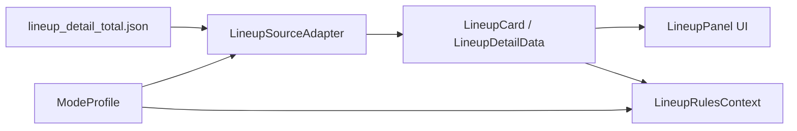

# HexSight 数据爬取文档

## 一、数据源全景

金铲铲之战官方网站 `jcc.qq.com` 是一个 Vue SPA（单页应用），所有游戏数据通过 JavaScript SDK 动态加载。

### 1.1 三类数据源

| 类型 | 协议 | 示例 | 用途 |
| ---- | ---- | ---- | ---- |
| **CDN JSON** | HTTP GET | `game.gtimg.cn/.../chess.js` | 英雄/装备/羁绊/海克斯静态数据库 |
| **API JSON** | HTTP POST | `mlol.qt.qq.com/go/jgame/get_lineup_recomm` | 阵容推荐/阵容详情动态数据 |
| **CDN 图片** | HTTP GET | `game.gtimg.cn/.../equip/1001.png` | 装备/英雄/羁绊图标 |

### 1.2 数据目录

```
config/game_data/
├── mode4/          # 天选福星
│   ├── chess.json  # 英雄数据库 (401条)
│   ├── equip.json  # 装备数据库 (165条)
│   ├── trait.json  # 羁绊数据库 (96条)
│   ├── hex.json    # 海克斯数据库 (339条)
│   ├── race.json   # 种族 (21条)
│   ├── job.json    # 职业 (15条)
│   └── ...         
├── mode16/         # 英雄联盟传奇
│   ├── chess.json  # 英雄数据库 (505条)
│   ├── equip.json  # 装备数据库 (191条)
│   ├── trait.json  # 羁绊数据库 (110条)
│   ├── hex.json    # 海克斯数据库 (282条)
│   └── ...
└── mode17/         # 星神 (当前赛季)
    ├── chess.json  # 英雄数据库 (427条)
    ├── equip.json  # 装备数据库 (278条)
    ├── trait.json  # 羁绊数据库 (83条)
    ├── hex.json    # 海克斯数据库 (279条)
    ├── race.json   # 种族 (22条)
    ├── job.json    # 职业 (12条)
    ├── god.json    # 星神赐福 (9条)
    └── ...
```

> 条目数来自当前仓库快照，后续刷新数据时以文件内 `data` 实际计数为准。

---

## 二、数据发现过程

### 2.1 环境要求

```bash
# Python 3.12+
pip3 install --break-system-packages "git+https://github.com/mdowis/anansi"
pip3 install --break-system-packages UnityPy        # 可选，用于解包 IPA
playwright install chromium                          # Anansi 浏览器模式依赖
```

### 2.2 发现链路

jcc.qq.com 的数据发现遵循以下链式追踪过程：

```
┌─────────────────────────────────────────────────────────┐
│ 1. 页面入口 jcc.qq.com/#/index                          │
│    加载 basicConfig.js → 发现 season/mode/hex_data_tpl  │
│    加载 JCCFrameworkChina.umd.js → 发现数据 SDK         │
│    加载 app.js → 发现路由表 /hero /quipment /synergy    │
├─────────────────────────────────────────────────────────┤
│ 2. basicConfig.js 中的关键字段                           │
│    baseUrlManager    → 所有 CDN 图片 URL 模板           │
│    hex_data_tpl      → 各赛季的资料库配置               │
│    equipment_type    → 装备分类定义                     │
│    is_show           → 页面显示的 tab 列表              │
├─────────────────────────────────────────────────────────┤
│ 3. SDK 源码追踪 (JCCFrameworkChina.umd.js)              │
│    getModeGameData() → 数据加载入口                     │
│    k(datakey, cfg)   → URL 构建器                       │
│    JCCFrameworkENV.convertGameDataUrlByVersionConfig()  │
│                      → 最终 URL 生成                    │
├─────────────────────────────────────────────────────────┤
│ 4. F12 浏览器控制台确认                                  │
│    打开 Chrome → F12 → Console                          │
│    导航到各页面，日志输出真实 CDN 请求:                   │
│    TryRun:fetchRequest https://game.gtimg.cn/.../...js  │
└─────────────────────────────────────────────────────────┘
```

### 2.3 关键发现：versiondataconfig.js

最终定位到版本配置中心：

```
https://game.gtimg.cn/images/lol/act/jkzlk/js/config/versiondataconfig.js
```

这个 105KB 的 JSON 文件包含了**所有赛季版本的完整 URL 映射**，每个赛季条目格式：

```json
{
  "version": "17.17.3",
  "season": "S18",
  "mode": "17",
  "name": "星神",
  "herourl": "/17/17.17.3-S18/chess.js",
  "equipurl": "/17/17.17.3-S18/equip.js",
  "traiturl": "/17/17.17.3-S18/trait.js",
  "hexurl": "/17/17.17.3-S18/hex.js",
  "raceurl": "/17/17.17.3-S18/race.js",
  "joburl": "/17/17.17.3-S18/job.js",
  "godurl": "/17/17.17.3-S18/god.js",
  "galaxyurl": "/17/17.17.3-S18/galaxy.js",
  ...
}
```

---

## 三、CDN 数据接口

### 3.1 基础 URL 模式

```
https://game.gtimg.cn/images/lol/act/jkzlk/js//{mode}/{version}-{season}/{type}.js
```

> `js//` 中的双斜杠来自官网真实拼接结果，保留即可。

| 参数 | 说明 | 示例 |
| ---- | ---- | ---- |
| `mode` | 游戏模式ID | 17=星神, 16=英雄联盟传奇, 4=天选福星 |
| `version` | 游戏版本号 | 17.17.3 |
| `season` | 赛季代号 | S18 |
| `type` | 数据类型 | chess/equip/trait/hex/race/job/god/galaxy/mission/goop/legend/adventure/tinyhero |

### 3.2 数据类型说明

| 文件 | 内容 | 典型条目数 | 大小 |
| ---- | ---- | ---- | ---- |
| `chess.js` | 英雄/棋子 | 400-500 | 350-650KB |
| `equip.js` | 装备 | 165-278 | 60-170KB |
| `trait.js` | 羁绊(种族+职业合并) | 80-110 | 55-130KB |
| `race.js` | 种族 | 21-36 | 9-28KB |
| `job.js` | 职业 | 12-15 | 4-9KB |
| `hex.js` | 强化符文 | 279-339 | 70-140KB |
| `god.js` | 星神赐福 | 0-9 | 0-48KB |
| `galaxy.js` | 星系/传送门 | 0-43 | 0-13KB |
| `mission.js` | 任务 | 0-40 | 0-22KB |
| `goop.js` | 异常突变 | 0-若干 | 0-若干 |
| `legend.js` | 传奇之力/传说相关 | 0-若干 | 0-若干 |
| `adventure.js` | 冒险玩法附加数据 | 0-若干 | 0-若干 |
| `tinyhero.js` | 小小英雄皮肤 | ~2510 | ~1.1MB |

### 3.3 数据格式（统一外层结构）

所有 `*.js` 文件均返回 JSON，外层结构统一：

```json
{
  "version": "17.17.3",
  "season": "S18",
  "setId": "17",
  "time": "2026-05-21 10:16:44",
  "data": {
    "<id>": { /* 具体数据字段，见下文 */ },
    ...
  }
}
```

### 3.4 英雄数据 (chess.js)

```json
{
  "id": "11450",
  "name": "崔斯特",
  "price": "1",              // 费用 (1-5)，注意是字符串类型
  "class": "314",            // 职业ID，注意关键字 class
  "species": "409",          // 种族ID
  "picture": "https://game.gtimg.cn/images/lol/act/jkzlk/mode17s18/hero/s17_head_twistedfate.png",
  "initHP": "500",           // 初始生命值，字符串
  "initAttackDamage": "30",  // 初始攻击力，字符串
  "attackSpeed": "0.70",     // 攻速，字符串
  "armor": "15",
  "magicResist": "15",
  "attackRange": "4",
  "skillName": "命运的断言",
  "skillDesc": "按幸运几率随机抽取...",
  "skillIcon": "https://game.gtimg.cn/images/lol/act/jkzlk/mode17s18/skill/s17_twistedfate.png",
  "heroType": "0",
  "heroPaint": "s17_twistedfate",  // 皮肤/模型标识
  "setid": "17",
  "tftHeroId": "11450",
  "mapID": "1"
}
```

**注意事项**：
- 包含训练假人（`price=0`, `name="木桩假人"`），客户端需过滤
- `price`, `initHP` 等数值字段均为**字符串类型**，不是数字
- `class` 是 Swift 保留字，解码时需特殊处理
- 同名英雄可能有多条记录（不同星级/变体），图鉴展示时需去重
- 种族和职业 ID 需关联 `race.js`/`job.js` 获取名称

**当前项目去重规则**：
- 原始 `heroes` 保留全量数据，便于识别与详情查询
- 图鉴展示使用 `HeroCatalog.displayHeroes(from:)`
- 折叠键为 `name`
- 保留项按 `(cost, hp, ad, id)` 取最小值

### 3.5 装备数据 (equip.js)

```json
{
  "id": "2001",
  "name": "无尽之刃",
  "type": "成型装备",         // 基础装备 / 成型装备 / 光明武器 / 神器装备 / 特殊装备 / 转职纹章
  "picture": "https://game.gtimg.cn/images/lol/act/jkzlk/gamedata/equip/2001.png",
  "basicDesc": "+35物理加成 +35%暴击率",
  "desc": "获得【技能暴击】...",
  "synthesis1": "1001",      // 合成材料1 ID (链接到基础装备)
  "synthesis2": "1009",      // 合成材料2 ID
  "icon": "2001",
  "EffectType": "0",
  "planID": "17",
  "setID": "17"
}
```

**装备类型枚举**：
| type | 名称 | 说明 |
| ---- | ---- | ---- |
| 基础装备 | 10种 | 暴风之剑、反曲之弓等散件 |
| 成型装备 | 39种 | 两件基础装备合成 |
| 光明武器 | 36种 | 强化版装备 |
| 特殊装备 | 38种 | 选秀/野怪掉落 |
| 神器装备 | 37种 | 奥恩神器等 |
| 转职纹章 | 19种 | 羁绊+1效果 |

**合成关系**：`synthesis1` + `synthesis2` 指向基础装备 ID，可用于构建合成树。

### 3.6 羁绊数据 (trait.js)

```json
{
  "id": 83100101,
  "checkId": "402",          // 用于去重——同羁绊不同 level 共享同一 checkId
  "name": "木灵族",
  "type": 0,                 // 0=种族(race), 1=职业(job) —— 注意是 Int
  "color": "1",
  "level": 1,                // 等级阈值级别，Int 类型
  "num": "3",                // 当前等级所需人数
  "numList": "3|5|7|10",    // 各级别人数要求
  "picture": "https://game.gtimg.cn/images/lol/act/jkzlk/mode17s18/trait/s17_trait_icon_astronaut.png",
  "desc": "【木灵族】吸引木灵...",
  "prefix": "【木灵族】吸引木灵..."
}
```

**去重规则**：
- 同一羁绊有多条记录（level=1,2,3...），`checkId` 相同
- 图鉴展示时取 `level` 最小的一条即可

**当前项目实现**：
- 全量 `traits` 保留所有等级记录
- 图鉴展示先按 `checkId` 分组，再取 `level` 最小的一条
- 阈值显示直接读取 `numList`

**与 race.js/job.js 的关系**：
- `trait.js` 是 race + job 的合并数据（type=0 是 race，type=1 是 job）
- `race.js` 和 `job.js` 是拆分的独立文件，结构类似但字段更少
- 推荐使用 `trait.js` 作为主要数据源

### 3.7 海克斯数据 (hex.js)

```json
{
  "id": "1002",
  "name": "存心失利",
  "level": "2",              // 1/2/3 级，注意是字符串
  "desc": "在输掉你的战斗环节之后，获得2金币和一次免费的商店刷新。",
  "icon": "https://game.gtimg.cn/images/lol/act/jkzlk/gamedata/hex/calculatedloss2.png",
  "is_legend": 0,            // 是否为英雄强化，Int 类型
  "hero_enhancement_type": "0",
  "fetterId": "",            // 关联羁绊ID（羁绊专属海克斯）
  "fetterType": "0"
}
```

**注意事项**：
- `level` 是字符串 ("1"/"2"/"3")，不是数字
- `is_legend` 是 Int (0/1)，不是 Bool
- `fetterId` 非空时表示该海克斯关联特定羁绊

---

## 四、API 接口（阵容数据）

### 4.0 当前项目阵容真实源

当前应用优先使用官方 CDN 的聚合阵容快照 `lineup_detail_total.json`，本地缓存放在 `config/lineups/`。该文件已经包含列表字段和 `detail` 字符串，适合做离线快照、回归测试和规则上下文生成。

| 模式 | 玩法 | CDN 路径 | 本地缓存 |
| ---- | ---- | ---- | ---- |
| mode17 | 星神 | `lineupJson/m18/11/17/lineup_detail_total.json` | `config/lineups/mode17_S18.json` |
| mode16 | 英雄联盟传奇 | `lineupJson/m17/11/16/lineup_detail_total.json` | `config/lineups/mode16_S18.json` |
| mode4 | 天选福星 | `lineupJson/m17/11/4/lineup_detail_total.json` | `config/lineups/mode4_S18.json` |

工程上由 `ModeProfile` 统一声明模式、赛季、CDN 路径和玩法能力；由 `LineupSourceAdapter` 统一把官方 JSON 转成 `LineupCard` / `LineupDetailData`；由 `LineupRulesContext` 输出规则引擎和 LLM 需要的结构化字段。



### 4.0.1 阵容 detail 字段矩阵

| 字段 | mode17 星神 | mode16 英雄联盟传奇 | mode4 天选福星 | 规则用途 |
| ---- | ---- | ---- | ---- | ---- |
| `hero_location` | ✅ | ✅ | ✅ | 最终阵容、装备归属、站位规则 |
| `contact` | ✅ | ✅ | ✅ | 羁绊总览与阵容目标 |
| `y21_early_heros` / `y21_metaphase_heros` | ✅ | ✅ | ✅ | 过渡阵容和阶段运营 |
| `hexbuff.recomm` / `hexbuff.replace` | ✅ | ✅ | ✅ | 强化符文优先级 |
| `equipment_order` | ✅ | ✅ | ✅ | 装备合成顺序 |
| `god_list` / `godreward_info` | ✅ |  |  | 星神奖励选择 |
| `task_list` / `task_info` |  | ✅ |  | 英雄解锁任务 |
| `chosen_contact` / `messengerContact` / `chosen_backup` |  |  | ✅ | 天选、使者和备选羁绊 |
| `staff_info` / `goop_info` / `traitparty_info` / `legendgalaxyinfo` |  |  | ✅ | 天选福星特殊机制说明 |

### 4.0.2 追版本校验命令

每次刷新 `config/game_data/` 或 `config/lineups/` 后，先跑规则上下文测试，再跑全量 Swift 验证。

```bash
cd swift
swift test --filter LineupAdapterSnapshotTests
swift test --filter LineupRulesContextTests
swift test
swift build
```

`LineupRulesContextTests` 会使用真实本地缓存验证以下核心数据：

| 校验项 | 数据源 | 失败含义 |
| ---- | ---- | ---- |
| 可读英雄 | `hero_location` + `chess.json` | 阵容棋子 ID 与静态数据版本错位 |
| 可读装备顺序 | `equipment_order` + `equip.json` | 装备 ID 或装备表变更未适配 |
| 可读强化符文 | `hexbuff` + `hex.json` | 强化符文 ID 或字段变更未适配 |
| 可读羁绊 | `contact` 或英雄羁绊反推 + `trait.json` | 羁绊 ID、类型或阈值规则变更 |
| 模式专属字段 | `god_list` / `task_list` / `chosen_*` | 玩法字段变更未进入适配层 |

### 4.1 阵容推荐列表

```
POST https://mlol.qt.qq.com/go/jgame/get_lineup_recomm
Content-Type: application/json

{
  "mode": "17",
  "season": "S18"
}
```

**响应结构**：
```json
{
  "result": 0,
  "msg": "",
  "data": {
    "client_data": {
      "lineid": ["1512667", "1512638", ...],    // 阵容ID列表
      "linedetail": {
        "1512667": { /* 阵容摘要，字段不完整 */ }
      }
    }
  }
}
```

### 4.2 阵容详情

```
POST https://mlol.qt.qq.com/go/jgame/get_lineup_detail
Content-Type: application/json

{
  "lineup_id": "1512667"
}
```

**响应结构**（关键字段）：

| 字段 | 类型 | 说明 |
| ---- | ---- | ---- |
| `name` | string | 阵容名称 |
| `detail` | string(JSON) | 阵容详情，需二次 JSON.parse |
| `main_chess` | string | 主C棋子名 |
| `main_trait_list` | string | 主羁绊列表 |

**detail 内层结构**（JSON.parse 后）：

| 字段 | 类型 | 说明 |
| ---- | ---- | ---- |
| `hero_location` | array | 8个棋子的位置/装备/名称 |
| `contact` | array | 羁绊组合（type/name/num） |
| `equipment_order` | string | 装备ID列表，逗号分隔 |
| `equipment_info` | string | 装备说明文本 |
| `hex_info` | string | 推荐海克斯文本 |
| `early_info` | string | 前期过渡策略 |
| `y21_early_heros` | array | 前期过渡棋子 |
| `y21_metaphase_heros` | array | 中期过渡棋子 |
| `location_info` | string | 站位建议 |
| `carry_hero_equip_replace` | object | 装备替换方案 {main, backup} |
| `smar_lineup_tag` | object | 智能推荐标签+胜率数据 |

---

## 五、CDN 图片资源

### 5.1 英雄头像

```
https://game.gtimg.cn/images/lol/act/jkzlk/mode{17}s{18}/hero/{pic_name}.png
```

示例：`https://game.gtimg.cn/images/lol/act/jkzlk/mode17s18/hero/s17_head_twistedfate.png`

### 5.2 装备图标

```
https://game.gtimg.cn/images/lol/act/jkzlk/gamedata/equip/{icon_id}.png
```

示例：`https://game.gtimg.cn/images/lol/act/jkzlk/gamedata/equip/1001.png`

### 5.3 羁绊图标

```
https://game.gtimg.cn/images/lol/act/jkzlk/mode{17}s{18}/trait/{pic_name}.png
```

### 5.4 海克斯图标

```
https://game.gtimg.cn/images/lol/act/jkzlk/gamedata/hex/{icon_name}.png
```

---

## 六、使用指南

### 6.1 拉取全部数据

```bash
# 拉取游戏数据库（英雄/装备/羁绊/海克斯）
python3 scripts/jcc_api.py fetch-gamedata

# 拉取阵容推荐
python3 scripts/jcc_api.py fetch-lineups

# 拉取全部
python3 scripts/jcc_api.py fetch-all
```

### 6.2 新赛季更新步骤

当金铲铲之战发布新赛季时，按以下步骤更新数据：

1. **确认新赛季参数**
   - 访问 `jcc.qq.com`，F12 → Console
   - 查看 `basicConfig.js` 中的 `mode` 和 `season` 变量
   - 或在 `versiondataconfig.js` 中搜索最新版本

2. **更新脚本默认参数**
   ```python
   # 编辑 scripts/jcc_api.py
   season: str = "S19"    # GameDataFetcher 默认赛季
   ```

   如果阵容 API 的 mode 也发生变化，还需同步修改 `fetch_lineups()` 里的请求体。

3. **拉取新数据**
   ```bash
   python3 scripts/jcc_api.py fetch-all
   ```

4. **更新 Swift 侧赛季列表**
   ```swift
   // 编辑 Services/GameDataService.swift
   let availableModes: [(id: String, name: String)] = [
       ("17", "星神"),
       ("18", "新赛季名"),  // 新增
       ...
   ]
   ```

### 6.3 本地验证流程

#### 数据文件验证

```bash
python3 - <<'PY'
import json, pathlib
root = pathlib.Path("config/game_data/mode17")
for name in ["chess", "equip", "trait", "hex", "race", "job"]:
    data = json.load(open(root / f"{name}.json"))
    print(name, len(data.get("data", {})))
PY
```

#### Swift 侧加载验证

启动应用后观察控制台：

- `"[HexSight] 开发模式加载配置: .../config/regions.json"`：配置路径正确
- `"[GameData] chess.json: 427 条"`：主数据加载成功
- `"[GameData] equip.json: 278 条"`
- `"[GameData] trait.json: 83 条"`
- `"[GameData] hex.json: 279 条"`

#### UI 展示验证

- 英雄页签应展示去重后的图鉴数据，当前 mode17 约 66 条
- 羁绊页签应按 `checkId` 折叠，同一羁绊只显示一条
- 装备与海克斯页签应显示完整条目

### 6.4 新增数据类型的步骤

如果未来官网新增了数据类型（如 `adventure.js`, `goop.js`），按以下步骤接入：

1. 从 `versiondataconfig.js` 找到新 URL key
2. 在 `DATA_TYPES` 字典中添加映射：
   ```python
   DATA_TYPES = {
       ...
       "adventureurl": "adventure",  # 新增
   }
   ```
3. 创建对应的 Swift Model（参考 `GameModels.swift`）
4. 在 `GameDataService` 中添加加载逻辑

---

## 七、已知问题与注意事项

### 7.1 数据类型不一致

CDN JSON 文件中，数值字段的**类型不稳定**：

| 字段 | 预期类型 | 实际可能类型 |
| ---- | ---- | ---- |
| `price` | String | String ("1") |
| `level` (trait) | Int | Int (1) |
| `level` (hex) | String | String ("2") |
| `is_legend` | Int | Int (0/1) |
| `type` (trait) | Int | Int (0/1) |
| `type` (equip) | String | String ("成型装备") |
| `initHP` | String | String ("500") |

**解决方案**：使用 `init?(dict:)` 手动解析，对每个字段做类型兼容处理。

### 7.2 特殊数据清洗

- 英雄数据包含训练假人（`name="木桩假人"`, `price=0`），**需要过滤**
- 英雄数据可能有**重名变体**、**不同星级记录**、**同名技能形态**，图鉴层需按 `name` 折叠
- 部分数据文件可能为**空**（如 mode17 的 galaxy.json 只有 2 字节 `{}`），需做空数据判断
- `race.js` / `job.js` 主要用于 ID→名称映射，主展示推荐使用 `trait.js`

### 7.3 API 频率限制

`mlol.qt.qq.com` 的阵容 API 有**频率限制**。建议：
- 单次请求间隔 ≥ 500ms
- 缓存结果，避免重复请求
- 不用于高频实时查询

### 7.4 版本号获取

`versiondataconfig.js` 中包含每个 mode 的所有历史版本。获取最新版本数据的逻辑：
1. 筛选 `season == "S18"` 的所有条目
2. 按 `version` 字符串比较取更大值
3. 取每个 `mode` 的最新一条

---

## 八、工具链

| 工具 | 用途 | 安装 |
| ---- | ---- | ---- |
| Anansi | 爬虫框架，支持 SPA 浏览器渲染 + TLS 指纹伪装 | `pip install git+https://github.com/mdowis/anansi` |
| Playwright | 无头浏览器引擎 | `playwright install chromium` |
| Chrome DevTools | 手动发现 API 端点 | 系统自带 |
| UnityPy | 解包 Unity AssetBundle (IPA 资源提取) | `pip install UnityPy` |

---

## 九、常见问题排查

**Q: 拉取数据时 HTTP 403/404？**

检查 versiondataconfig.js 中的 URL 是否正确。URL 中的 `//` 不是笔误——基础路径 `jkzlk/js/` 后确实有两个斜杠。

**Q: Swift 侧加载数据为空？**

1. 确认 `config/game_data/mode17/chess.json` 文件存在且非空
2. 检查 `ProjectPaths.gameDataDirectory(mode:)` 与 `ProjectPaths.configFile(named:)` 的路径计算是否正确
3. 查看 Xcode 控制台日志中 `[HexSight]` 和 `[GameData]` 前缀的输出

**Q: 装备/英雄图标不显示？**

CDN 域名 `game.gtimg.cn` 在某些网络环境下可能被限制。确认浏览器中能直接打开图片 URL。

**Q: 如何支持更多赛季的历史数据？**

`versiondataconfig.js` 中包含注释掉的历史赛季配置。取消注释后运行 `fetch-gamedata` 即可拉取。
