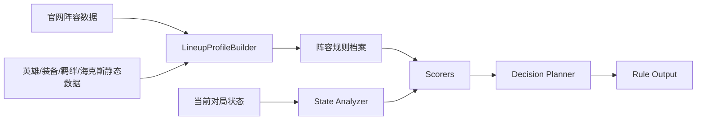

# HexSight 规则引擎最终目标阶段文档

## 结论

HexSight 的规则引擎目标是：**在未接入 LLM 的前提下，基于官网阵容数据、静态游戏数据和当前对局状态，稳定输出阵容选择、过渡路线、装备决策、经济节奏、海克斯选择、风险提示和转向条件**。

金铲铲这类游戏的本质是：**在随机性里做资源转换**。规则系统要持续回答：当前应该把血量、金币、装备、棋子、海克斯和信息，如何转换成最高的吃分概率和更高的吃鸡上限。

---

## 一、规则引擎核心原则

| 原则 | 说明 |
|---|---|
| 先少犯大错 | 第一版优先避免乱 D、乱合装、硬玩错阵容、贪经济暴毙 |
| 先吃分再吃鸡 | 先做稳定前四策略，再做高上限策略 |
| 先状态后推荐 | 先判断当前局势，再推荐阵容和动作 |
| 先玩法开关后阵容评分 | 专属海克斯、赌狗、任务、天选、星神奖励会改变阵容逻辑 |
| 规则输出必须可解释 | 每个推荐都要给理由、风险、转向条件 |
| UI 不参与推理 | Swift 只展示 Rust 规则引擎结果 |

---

## 二、基于官网数据的规则资产

当前官网数据能为规则引擎提供“阵容事实”。规则引擎负责判断“这局有没有资格玩”。

| 数据 | 字段 | 可生成规则 |
|---|---|---|
| 阵容基础信息 | `line_name`、`quality`、`line_tag` | 版本强度、阵容分类、基础优先级 |
| 最终阵容 | `hero_location` | 成型英雄、主 C、主坦、站位、装备绑定 |
| 过渡阵容 | `y21_early_heros`、`y21_metaphase_heros` | 前期/中期过渡推荐 |
| 装备 | `equipment_order`、棋子 `equipment_id` | 装备优先级、主 C 装、主坦装 |
| 强化符文 | `hexbuff.recomm`、`hexbuff.replace` | 海克斯适配度、阵容开关、备选方案 |
| 羁绊 | `contact` 或本地反推 | 成型羁绊、过渡羁绊、目标羁绊 |
| 运营文本 | `early_info`、`d_time`、`location_info`、`enemy_info` | 搜牌节奏、站位建议、克制说明 |
| mode17 星神 | `god_list`、`godreward_info` | 星神奖励选择与阶段收益 |
| mode16 任务 | `task_list`、`task_info` | 英雄解锁与任务型阵容 |
| mode4 天选 | `chosen_contact`、`chosen_backup`、`messengerContact` | 天选羁绊、使者机制、备选路线 |

---

## 三、最终规则架构



| 层级 | 职责 |
|---|---|
| `LineupProfileBuilder` | 从官网数据生成阵容规则档案 |
| `State Analyzer` | 分析当前阶段、血量、经济、装备、棋子、海克斯、同行 |
| `Playstyle Detector` | 判断常规运营、赌狗、速 8、速 9、专属海克斯、任务等玩法 |
| `Scorers` | 阵容、装备、海克斯、经济、过渡、风险评分 |
| `Decision Planner` | 输出存钱/升级/搜牌/合装/转阵容/止血动作 |
| `Explanation Builder` | 生成推荐理由、风险和转向条件 |

---

## 四、每套阵容的规则档案

每个官网阵容最终要转成一份稳定规则档案。

| 字段 | 来源 | 用途 |
|---|---|---|
| `lineupId` | 官方阵容 ID | 阵容唯一标识 |
| `name` | `line_name` | 展示和解释 |
| `baseTier` | `quality` | 版本基础强度 |
| `playstyleTags` | 自动推断 + 人工补充 | 常规、赌狗、速 8、专属等玩法 |
| `finalHeroIds` | `hero_location` | 成型目标 |
| `carryHeroIds` | `is_carry_hero` | 主 C 判断 |
| `coreEquipmentIds` | 主 C `equipment_id` | 装备匹配 |
| `tankEquipmentIds` | 前排装备 | 主坦匹配 |
| `equipmentOrderIds` | `equipment_order` | 拿装/合装优先级 |
| `recommendedHexIds` | `hexbuff.recomm` | 推荐海克斯 |
| `replacementHexIds` | `hexbuff.replace` | 备选海克斯 |
| `earlyHeroIds` | `y21_early_heros` | 前期过渡 |
| `midHeroIds` | `y21_metaphase_heros` | 中期过渡 |
| `traitTargets` | `contact` 或反推 | 羁绊目标 |
| `strategyTexts` | 运营文本 | 解释和提示 |
| `modeSpecific` | mode 特殊字段 | 星神、任务、天选等 |

---

## 五、玩法标签体系

玩法标签是规则引擎能否正确判断的关键。

| 标签 | 含义 | 规则影响 |
|---|---|---|
| `standard` | 常规运营 | 按正常节奏升级、找核心牌 |
| `reroll_1_cost` | 1 费赌狗 | 3-1 卡 4/5 级 D 或慢 D |
| `reroll_2_cost` | 2 费赌狗 | 3-2 升 6，卡 6 慢 D |
| `reroll_3_cost` | 3 费赌狗 | 4-1/4-2 七级慢 D |
| `fast_8` | 速 8 | 保经济，4-2 找四费核心 |
| `fast_9` | 速 9 | 高血高经济才推荐 |
| `tempo` | 节奏稳血 | 前中期强度优先 |
| `late_cap` | 后期上限 | 高费卡、上限羁绊、五费补强 |
| `augment_enabled` | 海克斯开关 | 拿到关键强化后阵容大幅加分 |
| `requires_augment` | 依赖专属强化 | 没有开关时降低推荐 |
| `item_strict` | 装备严格 | 装备不匹配时大扣分 |
| `item_flexible` | 装备弹性 | 适合未定阵容和过渡 |
| `econ_open` | 经济开局适合 | 适合经济海克斯和速等级 |
| `loss_streak` | 连败收菜 | 允许精致连败，要求止血节点 |
| `mode_special` | 模式特殊机制 | 星神、任务、天选、使者等独立处理 |

---

## 六、阵容选择规则

阵容选择通过候选评分完成，每套阵容都根据当前局势动态打分。

```text
阵容评分 =
版本基础分
+ 装备匹配分
+ 棋子命中分
+ 海克斯适配分
+ 羁绊成型分
+ 阶段适配分
+ 经济适配分
+ 血量安全分
+ 玩法开关分
- 同行风险
- 成型难度
- 装备错配风险
```

| 分数项 | 说明 |
|---|---|
| 版本基础分 | 来自 `quality`、`line_tag`、官网吃分信息 |
| 装备匹配分 | 当前装备是否接近主 C/主坦装备 |
| 棋子命中分 | 当前已有英雄是否接近最终/过渡阵容 |
| 海克斯适配分 | 已拿强化是否在推荐/备选列表里 |
| 羁绊成型分 | 当前棋子能否组成核心羁绊 |
| 阶段适配分 | 当前阶段是否适合该玩法 |
| 经济适配分 | 当前金币和等级能否支撑阵容 |
| 血量安全分 | 血量是否允许贪后期或赌三星 |
| 玩法开关分 | 专属海克斯、任务、天选、星神奖励等 |
| 同行风险 | 同阵容/核心卡竞争 |
| 成型难度 | 依赖三星、高费、专属、任务完成等 |

---

## 七、过渡阶段规则

过渡阶段目标是：**用最少经济换最多血量，或用可控血量换装备与经济**。

### 7.1 开局路线判断

| 路线 | 适合条件 | 规则策略 |
|---|---|---|
| 连胜 | 二星多、装备能合、战力海克斯、前排强 | 提前升人口、合通用强装、保连胜 |
| 精致连败 | 牌弱、缺关键装备、经济海克斯、血量安全 | 控强度、保利息、选秀抢装备、关键节点止血 |
| 混合过渡 | 战力中等、方向未定 | 保血量和利息，等待装备/海克斯/来牌确认方向 |

### 7.2 过渡战力评分

| 评分项 | 说明 |
|---|---|
| 二星数量 | 前期最直接战力 |
| 前排质量 | 能否拖时间减少掉血 |
| 输出质量 | 能否杀怪减少掉血 |
| 羁绊数量 | 是否激活有效羁绊 |
| 装备战力 | 是否有通用成装 |
| 海克斯战力 | 是否提供即时强度 |
| 站位质量 | 是否保护输出和集火 |
| 对手强度 | 当前战力在全场排名 |

### 7.3 精致连败规则

| 阶段 | 控血目标 |
|---|---|
| 2-1 ~ 2-3 | 每回合掉 2-5 血 |
| 2-5 ~ 2-7 | 每回合掉 4-8 血 |
| 3-1 | 判断是否继续控败 |
| 3-2 | 常规开始止血或补质量 |
| 低于 60 血 | 连败风险上升 |
| 低于 45 血 | 进入强止血判断 |
| 低于 35 血 | 停止贪经济，优先保命 |

| 场景 | 动作 |
|---|---|
| 输太多 | 补二星、补前排、补输出 |
| 差点赢 | 下关键战力，避免断连败 |
| 杀不掉怪 | 补输出或合小战力装 |
| 血量太低 | 停止控败，转止血 |
| 选秀前 | 保证靠后顺位拿关键装备 |
| 野怪前 | 确保能打过野怪 |

### 7.4 连胜规则

| 条件 | 动作 |
|---|---|
| 已 3 连胜 | 可投入金币保连胜 |
| 升人口能多开强羁绊 | 可提前升人口 |
| 装备能合通用强装 | 立即合装 |
| 买对子能提升即时战力 | 可买对子 |
| 投入后仍打不过前几家 | 停止重投入，转经济 |

---

## 八、装备规则

装备是最稳定的早期信息，能帮助判断阵容方向。

### 8.1 装备匹配

| 输入 | 判断 |
|---|---|
| 当前散件 | 能否合成阵容核心装备 |
| 当前成装 | 是否命中主 C/主坦装备 |
| 官网 `equipment_order` | 是否符合拿装优先级 |
| 备用阵容 | 装备是否兼容多个候选阵容 |

### 8.2 合装动作

| 场景 | 推荐动作 |
|---|---|
| 连胜路线 | 优先合即时战力装 |
| 精致连败 | 可等核心件，但要保杀怪能力 |
| 血量低 | 立即合能提升战力的装备 |
| 阵容未定 | 合通用输出装/通用坦装 |
| 阵容已锁 | 补主 C 和主坦核心装备 |
| 散件过多 | 提示装备闲置风险 |
| 装备严重不匹配 | 推荐转向装备更合适阵容 |

---

## 九、经济规则

经济规则必须和玩法标签绑定。

| 玩法 | 经济策略 |
|---|---|
| 常规运营 | 保经济，3-2 升 6，4-1/4-2 升 7/8 |
| 速 8 | 少搜牌，保血上 8 找四费核心 |
| 速 9 | 高血高经济才推荐 |
| 1 费赌狗 | 卡 4/5 级 D 三星，三星后上人口 |
| 2 费赌狗 | 6 级慢 D |
| 3 费赌狗 | 7 级慢 D |
| 血量低 | 金币转战力 |
| 连胜 | 可提前升人口保连胜 |
| 连败 | 保利息，关键回合止血 |

### 经济线参考

| 时间点 | 理想经济 |
|---|---|
| 2-3 | 10+ |
| 2-5 | 20+ |
| 2-7 | 30+ |
| 3-2 | 升 6 后仍有 20+ |
| 3-5 | 30+ 或质量足够 |
| 4-1 | 根据阵容决定升 7/8 或 D 牌 |

---

## 十、赌狗规则

赌狗阵容的本质是：**牺牲等级节奏，用金币在特定等级换核心三星概率**。

### 10.1 赌狗资格评分

| 判断项 | 规则 |
|---|---|
| 核心费用 | 决定卡几级 D |
| 当前牌数 | 核心牌越多，可赌分越高 |
| 同行数量 | 同行越多，赌狗分越低 |
| 装备匹配 | 主 C 装备越接近，分越高 |
| 血量 | 血量越低，容错越低 |
| 经济 | 金币越多，成功率越高 |
| 阶段 | 超过关键慢 D 阶段后扣分 |
| 海克斯 | 刷新、复制、低费强化大幅加分 |

### 10.2 赌狗节奏

| 核心费用 | 常见节奏 |
|---|---|
| 1 费 | 3-1 卡 4/5 级大 D 或慢 D |
| 2 费 | 3-2 升 6 后卡 6 慢 D |
| 3 费 | 4-1/4-2 七级慢 D |
| 任务赌狗 | 跟随任务解锁节点调整 |

### 10.3 赌狗输出

| 输出 | 示例 |
|---|---|
| 可赌程度 | 82/100 |
| 卡几级 | 6 级慢 D |
| 核心目标 | 主 C 三星 + 主坦二星 |
| 停手条件 | 主 C 三星或金币低于 20 |
| 放弃条件 | 同行 2 家以上、核心少于 4 张、血量低于 35 |

---

## 十一、海克斯规则

海克斯选择必须区分“通用收益”和“玩法开关”。

### 11.1 海克斯标签

| 标签 | 含义 | 选择逻辑 |
|---|---|---|
| `generic_combat` | 通用战力 | 稳血、保连胜 |
| `generic_econ` | 通用经济 | 高上限，需要控血能力 |
| `generic_item` | 装备/散件/重铸 | 弹性强，适合未定阵容 |
| `trait_commit` | 羁绊强化 | 看已有体系牌和装备 |
| `hero_commit` | 英雄专属 | 高锁定，看核心牌和装备 |
| `reroll_enable` | 赌狗开关 | 看核心牌数量和同行 |
| `tempo` | 前中期节奏 | 适合连胜/稳血 |
| `late_cap` | 后期上限 | 需要血量和经济支撑 |
| `mode_special` | 模式专属 | 星神、任务、天选等单独评估 |
| `high_risk` | 高风险高收益 | 需要额外风险校验 |

### 11.2 海克斯评分

```text
海克斯评分 =
基础强度
+ 当前阵容适配
+ 玩法开关价值
+ 阵容覆盖度
+ 血量经济修正
+ 阶段修正
+ 装备缺口修正
- 锁方向风险
- 执行难度
```

---

## 十二、第一个海克斯选择规则

第一个海克斯通常发生在阵容未定时，规则系统默认应该优先选择 **高弹性、高覆盖、低锁定风险** 的选项。

### 12.1 判断流程

```text
1. 判断开局强度
2. 判断当前装备方向
3. 判断海克斯是否是玩法开关
4. 评估海克斯支持多少候选阵容
5. 判断锁方向收益是否覆盖风险
6. 输出推荐、风险和后续观察条件
```

### 12.2 第一个海克斯选择原则

| 开局状态 | 优先级 |
|---|---|
| 强开局 | 战力保连胜 / 经济滚雪球 / 装备补强 |
| 弱开局 | 经济 / 装备 / 通用战力 |
| 装备方向明显 | 对应 AD/AP/坦装兼容海克斯 |
| 核心低费牌多 | 赌狗开关 / 刷新收益 / 低费强化 |
| 阵容牌很散 | 通用型优先 |
| 已有关键羁绊对子 | 羁绊海克斯可加分 |
| 有明确高收益玩法海克斯 | 进入玩法开关评估 |

### 12.3 允许第一个海克斯锁阵容的条件

| 条件 | 说明 |
|---|---|
| 英雄专属 + 已有核心牌 + 装备匹配 | 成型概率高 |
| 羁绊强化 + 已有多张体系牌 | 过渡平滑 |
| 赌狗强化 + 核心牌数量足够 | 三星路线成立 |
| 装备型强化刚好补齐核心装 | 方向明确 |
| 经济海克斯 + 场面可控 | 能转高等级阵容 |
| 模式专属强化收益巨大 | 玩法收益足够覆盖锁定风险 |

### 12.4 第一个海克斯输出

| 字段 | 示例 |
|---|---|
| 推荐海克斯 | A |
| 分数 | 84 |
| 类型 | 通用经济 / 阵容开关 |
| 是否锁阵容 | 否 |
| 支持阵容 | 阵容 A、阵容 B、阵容 C |
| 当前收益 | 经济收益高，保留弹性 |
| 后续计划 | 2-5 观察装备和核心牌，3-2 决定方向 |
| 风险 | 当前战力弱，需控血 |
| 转向条件 | 3-2 前掉血过多时优先补战力 |

---

## 十三、模式特殊规则

| 模式 | 数据 | 规则方向 |
|---|---|---|
| mode17 星神 | `god_list`、`godreward_info` | 阶段奖励选择、经济/战力节奏修正 |
| mode16 英雄联盟传奇 | `task_list`、`task_info` | 解锁任务优先级、任务完成节奏、任务阵容资格 |
| mode4 天选福星 | `chosen_contact`、`chosen_backup`、`messengerContact` | 天选羁绊锁定、备选天选、使者方向 |

---

## 十四、第一版规则模块优先级

| 优先级 | 模块 | 作用 |
|---|---|---|
| P0 | `LineupProfileBuilder` | 从官网数据生成阵容规则档案 |
| P0 | `OpeningRouteClassifier` | 判断连胜/连败/混合开局路线 |
| P0 | `TransitionStrengthScorer` | 计算当前过渡战力 |
| P0 | `LineupFitScorer` | 给当前局势下的阵容打分 |
| P0 | `ItemFitScorer` | 判断装备推向哪套阵容 |
| P0 | `RerollEligibilityScorer` | 判断赌狗资格 |
| P1 | `AugmentFitScorer` | 判断海克斯选择，尤其第一个海克斯 |
| P1 | `EconomyPlanner` | 判断存钱、升级、搜牌、止血 |
| P1 | `TransitionLineupMatcher` | 匹配官网过渡阵容 |
| P1 | `RiskScorer` | 输出同行、血量、装备、成型风险 |
| P1 | `DamageProfile` | 维护版本化阶段基础伤害表 |
| P1 | `BoardPowerScorer` | 计算己方和敌方棋盘战力 |
| P1 | `FightOutcomeEstimator` | 预测胜率、剩余棋子、掉血区间 |
| P2 | `ModeSpecialPlanner` | 星神、任务、天选等模式玩法 |
| P2 | `PositioningPlanner` | 后期站位与对位规则 |
| P2 | `ChampionCombatProfileBuilder` | 从棋子技能和属性生成战斗画像 |
| P1 | `AugmentEffectInterpreter` | 实时解析当前候选海克斯的数值/机制影响 |
| P2 | `DamagePredictionCalibrator` | 用实际战斗结果校准预测参数 |
| P0 | `RulePackLoader` | 加载版本化规则包和模式参数 |
| P0 | `SchemaValidator` | 校验官网字段、静态数据和规则包兼容性 |
| P1 | `PatchOverrideLoader` | 读取版本公告修正、热修、人工覆写参数 |

---

## 十五、规则输出目标

规则引擎最终输出不应只给一个答案，应输出结构化决策。

```json
{
  "strategy": "精致连败",
  "lineupRecommendations": [
    {
      "lineupId": "4514",
      "name": "【神谕龙王】3牧羊人3霸天机甲3神谕",
      "score": 86,
      "reason": ["装备匹配", "过渡英雄命中", "海克斯适配"],
      "risk": ["同行可能增加", "核心牌未到"]
    }
  ],
  "economyAction": {
    "action": "save_interest",
    "reason": "当前血量安全，优先吃 20 利息"
  },
  "itemAction": {
    "action": "hold_or_build_generic",
    "reason": "阵容未锁，优先保留装备弹性"
  },
  "augmentAction": {
    "recommended": "通用经济海克斯",
    "lockLineup": false,
    "followUp": "3-2 前根据来牌和装备确认方向"
  },
  "transitionAction": {
    "route": "loss_streak_control",
    "targetDamagePerRound": "4-8",
    "stopLossStage": "3-2"
  },
  "pivotConditions": [
    "3-2 前核心牌不到",
    "同行超过 2 家",
    "血量低于 45",
    "装备方向明显偏离当前候选阵容"
  ]
}
```

---


## 十六、战斗强度与损血预测模型

损血预测的目标是：**在战斗前判断大概率赢/输、小入/大入、是否需要止血**。第一版不追求完整还原游戏战斗动画，优先输出可解释的概率、区间和风险等级。

### 16.1 损血公式

已知战斗结果和剩余棋子数时，损血可以按版本伤害表稳定计算：

```text
玩家掉血 = 当前阶段基础伤害 + 对方剩余棋子数
```

| 输入 | 说明 |
|---|---|
| 当前阶段 | 查 `DamageProfile` 的阶段基础伤害 |
| 对战胜负 | 决定掉血方 |
| 对方剩余棋子数 | 每个存活棋子追加 1 点伤害 |
| 模式修正 | 特殊模式若存在额外规则，单独挂到 `ModeDamageModifier` |

第一版重点预测“对方会剩几个棋子”，并输出区间：

```json
{
  "winProbability": 0.62,
  "expectedDamageTaken": 2.8,
  "damageRange": [0, 6],
  "expectedEnemySurvivors": 1.4,
  "riskLevel": "medium",
  "confidence": 0.71
}
```

### 16.2 棋盘战力评分

棋盘战力由前排、输出、启动、控制、装备、羁绊和站位共同决定。

```text
boardPower =
  frontlineEHP * 0.30
+ backlineDPS * 0.30
+ burstPower * 0.15
+ traitPower * 0.10
+ itemPower * 0.10
+ controlPower * 0.05
```

| 分数项 | 说明 |
|---|---|
| `frontlineEHP` | 前排血量、护甲、魔抗、护盾、治疗、减伤 |
| `backlineDPS` | 普攻输出、技能输出、攻击距离、持续输出能力 |
| `burstPower` | 第一次施法爆发、处决、最大生命值伤害 |
| `traitPower` | 已激活羁绊对当前棋盘的即时收益 |
| `itemPower` | 成装数量、主 C/主坦装备命中、通用战力装 |
| `controlPower` | 眩晕、击飞、冰冻、破甲、魔抗击碎、重伤 |

双方战力差转换为胜率和剩余棋子预测：

| 战力差 | 预测输出 |
|---|---|
| 大幅领先 | 高概率赢，预计剩 2-4 个棋子 |
| 小幅领先 | 中高概率赢，预计剩 1-2 个棋子 |
| 接近 | 五五开，掉血区间拉宽 |
| 小幅落后 | 中高概率输，预计被入 1-3 个棋子 |
| 大幅落后 | 高概率输，预计被入 4 个以上棋子 |

### 16.3 棋子战斗画像

每个棋子生成 `ChampionCombatProfile`，供战斗评分使用。

| 字段 | 说明 |
|---|---|
| `roleTags` | 主 C、副 C、主坦、副坦、控制、功能、召唤 |
| `damageType` | 物理、魔法、真实、混合 |
| `attackPattern` | 单体、范围、弹射、穿透、全屏、召唤物 |
| `targeting` | 当前目标、最远、最低血量、最密集、后排 |
| `castTempo` | 快启动、中启动、慢启动 |
| `specialTags` | 处决、破甲、魔抗击碎、减疗、护盾、治疗、技能暴击 |

第一版从 `chess.json` 的 `skillDesc`、`skillValueDesc` 和基础属性生成，采用关键词规则：

| 文本特征 | 标签 |
|---|---|
| “被动”“每次攻击”“额外攻击” | 普攻增强 |
| “周围”“范围”“所有敌人”“全场” | 范围输出 |
| “距离最远”“血量最低”“敌人最多” | 特殊索敌 |
| “眩晕”“击飞”“冰冻”“恐惧” | 控制 |
| “护盾”“治疗”“回复”“减伤” | 生存 |
| “处决”“最大生命值” | 高价值伤害 |
| “护甲击碎”“魔抗击碎”“重伤”“灼烧” | 减益 |

### 16.4 海克斯对战斗方式的影响

海克斯分为数值型和机制型两类：

| 类型 | 处理 |
|---|---|
| 数值型 | 攻击力、法强、攻速、生命值、护甲、魔抗、金币等直接转成数值修正 |
| 机制型 | 弹射、额外攻击、技能暴击、召唤、特殊斩杀等转成标签，并降低置信度 |

`AugmentEffectInterpreter` 不依赖历史高频统计。第一版只解析当前对局出现的候选海克斯：通过静态数据、推荐阵容关系、文本关键词和少量通用机制词典，实时生成标签与数值修正。历史统计只作为后续校准输入，不能成为首版决策前提。

| 标签 | 影响 |
|---|---|
| `attack_pattern_modifier` | 改变棋子输出模型 |
| `mana_acceleration` | 提前第一次施法 |
| `teamwide_damage_amp` | 提升全队输出 |
| `survivability_amp` | 提升前排承伤 |
| `control_amp` | 提升控制价值 |
| `econ_only` | 当前战力提升较低 |
| `lineup_lock` | 强化特定阵容方向 |

### 16.5 损血预测输出

`FightOutcomeEstimator` 输出的重点是决策可用性。

| 输出 | 用途 |
|---|---|
| `winProbability` | 判断是否保连胜、是否需要补战力 |
| `expectedDamageTaken` | 判断当前血量能否继续贪经济 |
| `damageRange` | 判断小入/大入风险 |
| `expectedEnemySurvivors` | 给损血公式使用 |
| `riskLevel` | UI 直接展示风险等级 |
| `confidence` | 告诉用户本次预测可靠程度 |
| `reason` | 解释影响胜负的关键因素 |

示例：

```json
{
  "fight": {
    "winProbability": 0.38,
    "expectedDamageTaken": 5.6,
    "damageRange": [3, 9],
    "expectedEnemySurvivors": 3.1,
    "riskLevel": "high",
    "confidence": 0.66,
    "reason": [
      "敌方主C两件成装",
      "我方前排只有一张二星",
      "当前输出能杀掉部分敌方低质量棋子"
    ],
    "recommendedAction": "补前排或合即时战力装，避免被大入"
  }
}
```

### 16.6 校准机制

规则引擎需要记录每轮预测和实际结果，用于调参。

| 记录项 | 用途 |
|---|---|
| 预测胜率 | 判断胜负方向是否偏差 |
| 预测掉血区间 | 判断掉血区间是否覆盖实际 |
| 实际掉血 | 计算误差 |
| 实际剩余棋子数 | 校准剩余棋子预测 |
| 双方棋盘快照 | 追溯偏差来源 |
| 双方装备/海克斯 | 补全装备和海克斯标签 |

误差分桶：

| 偏差来源 | 处理 |
|---|---|
| 阶段基础伤害错误 | 更新 `DamageProfile` |
| 棋子识别缺失 | 降低置信度并反馈视觉链路 |
| 装备识别缺失 | 降低装备分权重 |
| 海克斯机制未建模 | 补通用机制词典或版本覆写 |
| 站位影响过大 | 增加切后排、集火、对位风险规则 |
| 召唤物/特殊单位 | 加 `summon_damage_modifier` |

### 16.7 第一版验收目标

| 指标 | 目标 |
|---|---|
| 已知剩余棋子时损血误差 | 0 |
| 早中期剩余棋子预测 | 平均误差 ≤ 1 个棋子 |
| 2-3 阶段掉血预测 | 误差 ≤ 2 血 |
| 4 阶段后掉血预测 | 误差 ≤ 4 血 |
| 大入预警 | 能提前标记 8+ 掉血风险 |
| 精致连败判断 | 能区分可控小输、大入风险、必须止血 |

---

## 十七、版本更新与规则可持续性

工程可持续性是规则引擎最高准则。版本更新时允许更新数据、配置、参数和少量覆写文件，规则代码保持稳定边界，避免每个赛季重写评分器。

### 17.1 可变内容必须外置

| 类型 | 存放方式 | 更新频率 | 说明 |
|---|---|---|---|
| 官网阵容数据 | `config/lineups` | 每次官方更新 | 阵容事实来源 |
| 静态游戏数据 | `config/game_data/mode*` | 每次官方更新 | 英雄、装备、羁绊、海克斯、模式机制 |
| 规则参数 | `config/rules/<version>/rule_pack.json` | 按版本调整 | 权重、阈值、节奏线、损血表 |
| 模式参数 | `config/rules/<version>/modes/*.json` | 按模式调整 | 星神、任务、天选等模式差异 |
| 版本公告修正 | `config/rules/<version>/patch_overrides.json` | 热修/公告后调整 | 棋子削弱增强、装备改动、羁绊改动 |
| 人工覆写 | `config/rules/<version>/manual_overrides.json` | 少量校准 | 特殊海克斯、特殊阵容、特殊英雄逻辑 |
| 本地统计 | `data/calibration/*.jsonl` | 对局后追加 | 预测误差、掉血误差、阵容结果 |

规则代码只读取这些输入，输出统一结构。版本变化优先改数据和规则包。

### 17.2 规则包结构

```json
{
  "version": "S18.1",
  "modes": ["17", "16", "4"],
  "damageProfile": {
    "2": 0,
    "3": 2,
    "4": 4,
    "5": 6
  },
  "weights": {
    "lineupFit": {
      "itemFit": 0.22,
      "championHit": 0.18,
      "augmentFit": 0.16,
      "economyFit": 0.14,
      "healthSafety": 0.12
    },
    "boardPower": {
      "frontlineEHP": 0.30,
      "backlineDPS": 0.30,
      "burstPower": 0.15,
      "traitPower": 0.10,
      "itemPower": 0.10,
      "controlPower": 0.05
    }
  },
  "thresholds": {
    "lockLineupScore": 75,
    "pivotRiskScore": 70,
    "mustStabilizeHealth": 35,
    "largeDamageWarning": 8
  }
}
```

### 17.3 版本更新流程

| 步骤 | 动作 | 验收 |
|---|---|---|
| 1 | 拉取官网阵容和静态数据 | 文件存在、JSON 可解析 |
| 2 | 运行 `SchemaValidator` | 字段缺失、ID 错位、解析率有报告 |
| 3 | 生成 `LineupProfile` | 每套阵容都有玩法、装备、过渡、羁绊基础画像 |
| 4 | 生成候选海克斯实时标签 | 当前候选海克斯能输出标签、收益、锁定风险 |
| 5 | 应用 `patch_overrides` | 版本公告中的削弱增强进入参数层 |
| 6 | 跑规则回归样例 | 推荐阵容、合装、经济、止血输出稳定 |
| 7 | 对局后写校准数据 | 预测误差可追踪，可回放 |

### 17.4 海克斯实时解析原则

海克斯选择来自当前对局实时候选项，第一版不要求预先拥有高频统计。

| 输入 | 作用 |
|---|---|
| 当前三个候选海克斯 | 本轮评分对象 |
| 海克斯静态描述 | 文本解析数值、机制、适配方向 |
| 官网阵容推荐/备选海克斯 | 判断和候选阵容的匹配度 |
| 当前棋盘与装备 | 判断当前收益和锁方向风险 |
| 通用机制词典 | 识别经济、战力、装备、羁绊、英雄专属、赌狗开关 |
| 版本覆写 | 处理文本难解析或机制特殊的海克斯 |
| 历史统计 | 后续校准，不作为首版依赖 |

`AugmentEffectInterpreter` 输出：

```json
{
  "augmentId": "xxx",
  "tags": ["generic_item", "tempo"],
  "immediatePower": 62,
  "lineupCoverage": 4,
  "lockRisk": 18,
  "reason": ["提供装备弹性", "支持多套候选阵容", "当前阶段不强锁方向"]
}
```

### 17.5 代码边界

| 层 | 稳定职责 | 可变输入 |
|---|---|---|
| `core` | 数据类型、规则输出 Schema | 低频变更 |
| `engine` | 评分器、解释器、规划器 | 规则包、官网数据、对局状态 |
| `rules config` | 权重、阈值、版本修正、模式差异 | 高频变更 |
| `calibration` | 预测误差、统计分布、实战回放 | 持续追加 |
| `Swift` | 展示 Rust 输出 | UI 需要时变更 |

### 17.6 回归样例必须沉淀

每次规则争议都沉淀成可回放样例：

| 样例类型 | 检查点 |
|---|---|
| 第一海克斯选择 | 是否高弹性、低锁定风险、解释清楚 |
| 赌狗资格 | 牌数、经济、血量、同行、装备是否进入判断 |
| 精致连败 | 预计掉血区间和止血线是否合理 |
| 阵容锁定 | 分数达到锁定阈值时理由是否充分 |
| 转阵容 | 放弃线触发时是否给出替代阵容 |
| 版本热修 | 参数调整后是否影响对应阵容评分 |

---

## 十八、需要人工查缺补漏的地方

这些内容建议你重点审核，因为它们决定规则质量。

| 待确认项 | 为什么重要 |
|---|---|
| 每套阵容的玩法标签 | 官网数据能提供阵容事实，但赌狗/速 8/专属依赖需要补标签 |
| 海克斯标签表 | 第一个海克斯和玩法开关依赖标签质量 |
| 赌狗牌数阈值 | 不同赛季节奏不同，阈值需要实战校准 |
| 精致连败血量线 | 高手控血需要按当前版本伤害节奏调参 |
| 装备通用性表 | 哪些装备适合未定阵容，需要版本经验 |
| 同行识别规则 | 需要定义如何从对手棋盘判断同行 |
| 阵容锁定条件 | 什么时候从观察变成锁阵容，需要实战规则 |
| 转阵容条件 | 硬玩失败的代价很高，需要明确放弃线 |
| 模式特殊机制 | 星神、任务、天选每个模式玩法都要单独补规则 |
| 选秀优先级 | 连败抢装备、连胜补短板需要明确优先级 |
| 后期站位规则 | 第一版可弱化，后续影响吃鸡上限 |

---

## 十九、阶段验收标准

| 阶段 | 验收标准 |
|---|---|
| 第一阶段 | 能基于官网阵容数据生成阵容规则档案 |
| 第二阶段 | 能根据当前装备、棋子、海克斯推荐 3 套候选阵容 |
| 第三阶段 | 能识别连胜、精致连败、混合过渡 |
| 第四阶段 | 能判断第一个海克斯是否锁方向 |
| 第五阶段 | 能判断赌狗资格和卡等级 D 牌节奏 |
| 第六阶段 | 能输出经济动作、装备动作、风险和转向条件 |
| 第七阶段 | mode17/mode16/mode4 都能输出模式专属规则建议 |
| 第八阶段 | 能输出胜率、预计剩余棋子、掉血区间和大入预警 |
| 第九阶段 | 能通过规则包、版本覆写和回归样例完成版本更新 |

---

## 二十、最终目标

最终规则引擎要做到：

1. 看到当前局势后，判断开局路线：连胜、连败、混合。
2. 根据官网数据和当前状态，推荐 Top3 阵容。
3. 判断当前是否适合赌狗、速 8、速 9、任务阵容、天选阵容、星神路线。
4. 在第一个海克斯阶段，不盲目锁阵容，优先评估弹性和玩法开关收益。
5. 给出装备合成、经济操作、过渡棋盘、止血节点。
6. 明确告诉用户：为什么推荐、风险在哪里、什么时候转向。
7. 全部推理在 Rust 后端完成，Swift 只负责展示。
8. 对每轮战斗给出小入/大入风险和掉血区间，支持精致连败与止血判断。
9. 版本更新主要通过数据、规则包、覆写和回归样例完成，保持规则代码稳定。
