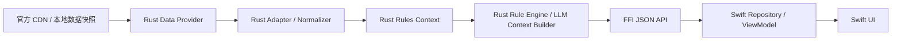
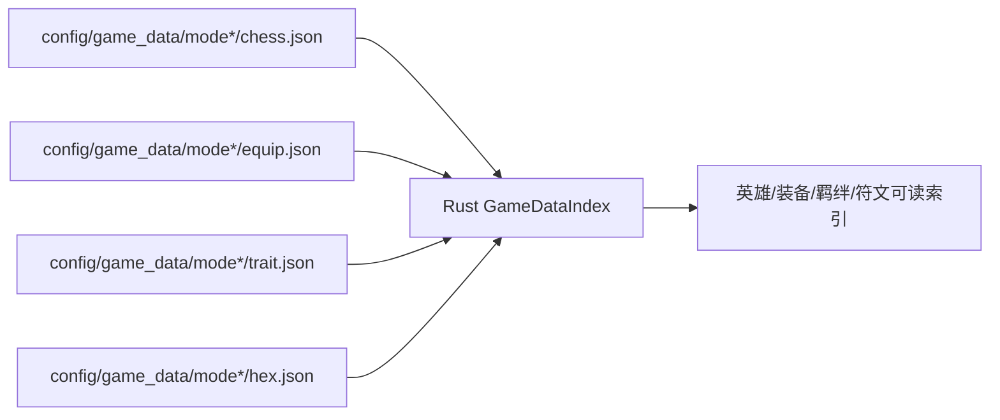
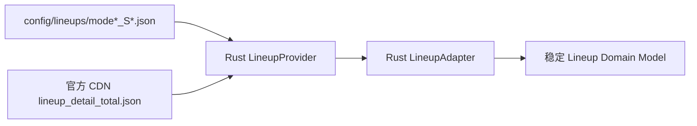
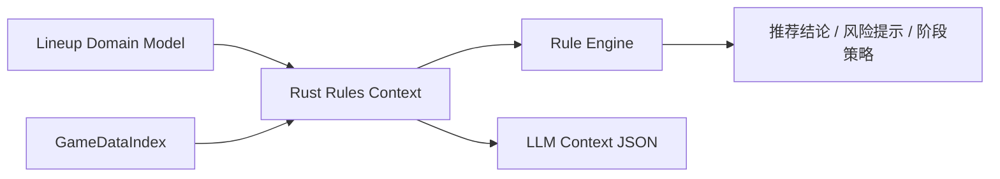

# HexSight Rust 后端化最终目标阶段文档

## 结论

HexSight 的最终工程目标是：**Swift 只负责 UI 展示和用户交互，Rust 负责数据提供、版本适配、规则上下文生成和后续推理规则执行**。

这个方向更适合项目长期维护。阵容、英雄、装备、羁绊、强化符文会频繁随赛季变化，规则推理也会持续扩展，把这些能力放在 Rust 核心层可以获得更强的可测试性、可复用性和版本追踪能力。

---

## 一、最终架构目标



| 层级 | 最终职责 |
|---|---|
| Rust Data Provider | 读取本地 `config/game_data`、`config/lineups`，必要时拉取官方 CDN |
| Rust Adapter / Normalizer | 官方字段兼容、模式差异适配、数据归一化 |
| Rust Rules Context | 生成英雄、装备、羁绊、符文、站位、模式机制的稳定结构化上下文 |
| Rust Rule Engine | 执行后续推理规则、优先级判断、推荐解释 |
| Rust LLM Context Builder | 输出 LLM 可消费的精简上下文 JSON |
| Swift Repository | 调用 FFI，解码 Rust 返回结果 |
| Swift UI | 展示列表、详情、棋盘、图标和交互 |

---

## 二、为什么推理规则应放 Rust

| 维度 | Rust 核心层收益 |
|---|---|
| 追版本 | 官方字段变化集中在 Adapter 和 ModeProfile，不扩散到 UI |
| 规则测试 | 可以用 `cargo test --workspace` 跑纯逻辑测试，不依赖窗口和 SwiftUI 生命周期 |
| 规则复用 | 同一套规则可供 UI、CLI、自动化测试、LLM 上下文生成复用 |
| 性能 | 大量阵容、英雄、装备、羁绊索引和规则计算更适合放在 Rust |
| 边界清晰 | Swift 负责显示，Rust 负责数据事实和推理判断 |
| LLM 质量 | Rust 可以稳定生成结构化上下文，减少 Swift 展示状态对推理的干扰 |

---

## 三、最终数据流

### 3.1 静态数据



### 3.2 阵容数据



### 3.3 规则推理



---

## 四、Swift 最终边界

Swift 保留以下职责：

| Swift 区域 | 职责 |
|---|---|
| `Views/` | 展示 UI、处理点击、滚动、弹窗、导航 |
| `ViewModel / Repository` | 调用 `RustBridge`，把 JSON 解码成 Swift 展示模型 |
| `Bridge/RustBridge.swift` | 封装 FFI 调用 |
| `Bridge/hexsight.h` | C FFI 头文件（12 个函数声明） |
| `Models` | UI 展示需要的轻量模型 |

以下职责已迁移至 Rust：

| 已迁移职责 | Rust 模块 |
|---|---|
| 直接读取阵容 JSON | `game_data_loader.rs` + `lineup_loader.rs` |
| 直接请求官方阵容 CDN | `remote_lineup_source.rs` |
| 解析官方 `detail` 字符串 | `lineup_adapter.rs` |
| 根据棋子反推羁绊 | `game_data_index.rs` |
| 生成规则/LLM 输入 | `rules_context.rs` / `llm_context.rs` |
| 远端阵容 CDN 刷新 | `remote_lineup_source.rs` |
| 阵容数据源适配 | `lineup_adapter.rs`（已删除 Swift `LineupSourceAdapter`） |

以下职责属于后续阶段：

| 暂留 Swift | 说明 |
|---|---|
| `GameDataService` | 图鉴面板静态数据（英雄/装备/羁绊/海克斯 ID 映射），涉及多个 UI 面板重连 |

---

## 五、Rust 模块目标

| 模块 | 实际路径 | 职责 | 状态 |
|---|---|---|---|
| 核心类型 | `crates/hexsight-core/src/data_types.rs` | HeroData、EquipmentData、TraitData、HexData、LineupCardData、LineupDetailData 等 | ✅ |
| 数据加载 | `crates/hexsight-engine/src/game_data_loader.rs` | 读取 `config/game_data/mode*/` 本地快照 | ✅ |
| 阵容加载 | `crates/hexsight-engine/src/lineup_loader.rs` | 读取 `config/lineups/` 阵容缓存 | ✅ |
| 远端刷新 | `crates/hexsight-engine/src/remote_lineup_source.rs` | CDN URL 拼装、HTTP 请求、缓存写入 | ✅ |
| 官方适配 | `crates/hexsight-engine/src/lineup_adapter.rs` | 解析 `lineup_detail_total.json` 和 `detail` 字段 | ✅ |
| 静态索引 | `crates/hexsight-engine/src/game_data_index.rs` | ID → 名称/图标/描述索引，羁绊反推 | ✅ |
| 规则上下文 | `crates/hexsight-engine/src/rules_context.rs` | 生成可读规则上下文，对齐第七章 JSON Schema | ✅ |
| LLM 上下文 | `crates/hexsight-engine/src/llm_context.rs` | 输出 LLM 可消费的精简上下文 JSON | ✅ |
| 版本校验 | `crates/hexsight-engine/src/version_validator.rs` | 检查 hero_id/equip_id 对齐，报告缺失 | ✅ |
| 推理规则 | `crates/hexsight-engine/src/rules.rs` | 阵容、装备、符文、过渡、站位等规则 | ⚠️ 骨架 |
| FFI | `crates/hexsight-ffi/src/data_ffi.rs` | 6 个 C ABI JSON API 暴露给 Swift | ✅ |

### Swift 侧对应模块

| 模块 | 实际路径 | 职责 | 状态 |
|---|---|---|---|
| 数据仓库 | `Services/LineupRepository.swift` | 封装 FFI 调用，提供 `@Published` 数据流 | ✅ |
| FFI 桥接 | `Bridge/RustBridge.swift` | C FFI 声明与封装（新增 6 个数据 API） | ✅ |
| FFI 头文件 | `Bridge/hexsight.h` | C 头文件，12 个 FFI 函数声明 | ✅ |
| 阵容页 | `Views/Panels/LineupPanel.swift` | 调用 `LineupRepository`，UI 布局不变 | ✅ |
| 模式配置 | `Lineups/ModeProfile.swift` | 模式 ID/名称/赛季/能力（CDN 字段已移除） | ✅ |
| 数据策略 | `Services/LineupCatalog.swift` | 模式集合声明、空态文案 | ✅ |

---

## 六、FFI 目标接口

Rust 最终建议暴露 JSON 字符串接口，降低 Swift/Rust 结构体同步成本。

| FFI 接口 | 用途 |
|---|---|
| `hexsight_get_supported_modes_json()` | 返回支持模式、赛季、玩法能力 |
| `hexsight_get_lineups_json(mode)` | 返回某模式阵容列表和详情摘要 |
| `hexsight_get_lineup_detail_json(mode, lineup_id)` | 返回阵容详情展示数据 |
| `hexsight_get_lineup_rules_context_json(mode, lineup_id)` | 返回规则/LLM 上下文 |
| `hexsight_refresh_lineups_json(mode)` | 刷新远端阵容缓存 |
| `hexsight_validate_data_snapshot_json(mode)` | 校验静态数据和阵容数据是否对齐 |

---

## 七、Rules Context JSON 最低字段要求

```json
{
  "mode": {
    "id": "17",
    "name": "星神",
    "season": "S18",
    "capabilities": ["standardLineup", "godRewards", "transitionContacts"]
  },
  "lineup": {
    "id": "4514",
    "name": "【神谕龙王】3牧羊人3霸天机甲3神谕",
    "author": "掌盟阵容推荐小助手",
    "quality": "S",
    "tags": ["高手进阶"]
  },
  "finalHeroes": [
    {
      "id": "14384",
      "name": "超级机甲",
      "cost": 4,
      "position": "1,4",
      "isCarry": false,
      "equipmentIds": ["2028", "2034", "2007"],
      "equipmentNames": ["石像鬼石板甲", "狂徒铠甲", "斯特拉克的挑战护手"]
    }
  ],
  "traits": [
    {
      "id": "race-409",
      "name": "牧羊人",
      "type": "race",
      "count": 3,
      "level": 1
    }
  ],
  "augments": {
    "recommended": [
      { "id": "1895", "name": "四费增援", "level": 2 }
    ],
    "replacement": []
  },
  "equipment": {
    "order": [
      { "id": "1003", "name": "无用大棒" }
    ]
  },
  "modeSpecific": {
    "godRewards": [],
    "unlockTasks": [],
    "chosen": null
  },
  "strategyTexts": {
    "earlyInfo": "",
    "dTime": "",
    "locationInfo": "",
    "enemyInfo": "",
    "hexInfo": "",
    "equipmentInfo": ""
  }
}
```

---

## 八、分阶段落地计划

### 阶段 1：Rust 读取本地数据 ✅

| 交付 | 验收 | 状态 |
|---|---|---|
| Rust 读取 `config/game_data` | 能解析 mode17/mode16/mode4 的英雄、装备、羁绊、海克斯 | ✅ |
| Rust 读取 `config/lineups` | 能解析三种模式阵容缓存 | ✅ |
| Rust 单测 | `cargo test --workspace` 通过 | ✅ |

### 阶段 2：Rust 生成规则上下文 ✅

| 交付 | 验收 | 状态 |
|---|---|---|
| `GameDataIndex` | ID 能解析为名称、图标、描述 | ✅ |
| `LineupAdapter` | 官方 detail 字段归一化 | ✅ |
| `RulesContext` | 输出可读英雄、装备、羁绊、强化符文、模式特殊机制 | ✅ |
| 快照测试 | 每个支持模式至少 1 条真实阵容测试 | ✅ |

### 阶段 3：FFI 接入 Swift ✅

| 交付 | 验收 | 状态 |
|---|---|---|
| FFI JSON API | Swift 能拿到模式、阵容列表、详情、规则上下文 | ✅ |
| `RustBridge.swift` | 封装 FFI 调用和错误处理 | ✅ |
| `LineupRepository.swift` | Swift 只通过 Repository 获取阵容数据 | ✅ |

### 阶段 4：Swift 数据职责收敛 ✅

| 交付 | 验收 | 状态 |
|---|---|---|
| `LineupPanel.swift` 切换数据入口 | UI 布局无变化 | ✅ |
| 移除 Swift 阵容解析逻辑 | `LineupSourceAdapter`/`GameDataIndex`/`LineupRulesContext` 源码已删除 | ✅ |
| 远端刷新下沉 Rust | `URLSession` 阵容拉取已移除，CDN 由 Rust 负责 | ✅ |
| Swift 测试 | `cd swift && swift test && swift build` 通过 | ✅ |

### 阶段 5：规则引擎后端化 ⚠️

| 交付 | 验收 | 状态 |
|---|---|---|
| LLM 上下文生成器 | 输出稳定、精简、可解释 JSON | ✅ |
| 版本校验工具 | 检查新赛季字段缺失、ID 错位、阵容可解析率 | ✅ |
| 远端刷新 | CDN URL 拼装、HTTP 请求、缓存写入全在 Rust | ✅ |
| Rust 规则模块 | 能基于 RulesContext 输出推荐结论 | ⚠️ 骨架 |

---

## 九、验收标准

| 验收项 | 证明方式 | 状态 |
|---|---|---|
| UI 布局未改 | `LineupPanel.swift` 只改数据入口，不改列表、详情、棋盘布局函数 | ✅ |
| Swift 不直接解析阵容官方 JSON | `rg "LineupSourceAdapter\|lineup_detail_total" swift/Sources/HexSight/Views swift/Sources/HexSight/Services` 无阵容解析逻辑 | ✅ |
| 远端刷新在 Rust | `rg "URLSession\|lineup_detail_total" swift/Sources/HexSight/Views swift/Sources/HexSight/Services` 无远端阵容拉取 | ✅ |
| 旧适配层已移除 | `LineupSourceAdapter.swift`/`GameDataIndex.swift`/`LineupRulesContext.swift` 已删除 | ✅ |
| Rust 能解析三种模式 | Rust 测试覆盖 mode17/mode16/mode4 本地缓存 | ✅ |
| 规则上下文可读 | 测试断言英雄名、装备名、羁绊名、强化符文名存在 | ✅ |
| Swift 能拿到 Rust 数据 | `LineupRepositoryTests` 7 个测试覆盖三模式 | ✅ |
| 构建通过 | `cargo test --workspace`(37) + `swift test`(17) + `swift build` 通过 | ✅ |
| FFI 头文件同步 | `hexsight.h` 包含 12 个 FFI 函数声明 | ✅ |

---

## 十、最终原则

| 原则 | 说明 |
|---|---|
| Swift 负责显示 | SwiftUI 只关心布局、交互、展示状态 |
| Rust 负责事实 | 数据读取、字段适配、ID 解析、规则上下文由 Rust 负责 |
| 规则靠后端 | 阵容判断、装备优先级、符文推荐、过渡策略由 Rust 规则层完成 |
| 版本靠测试追 | 每次更新赛季数据必须跑 Rust 和 Swift 回归测试 |
| UI 不参与推理 | UI 只展示 Rust 输出的结果，避免展示逻辑影响规则判断 |

---

## 十一、当前阶段边界

本阶段（阵容与规则上下文后端化）验收范围：

| 范围 | 说明 |
|---|---|
| Rust 负责 | 阵容读取、解析、适配、规则上下文生成、LLM 上下文、远端 CDN 刷新 |
| Swift 保留 | 图鉴面板静态数据（英雄/装备/羁绊/海克斯 ID 映射）仍由 `GameDataService` 管理 |
| 下阶段迁移 | 图鉴静态数据全量下沉 Rust，规则引擎基于 RulesContext 执行推理评分 |

